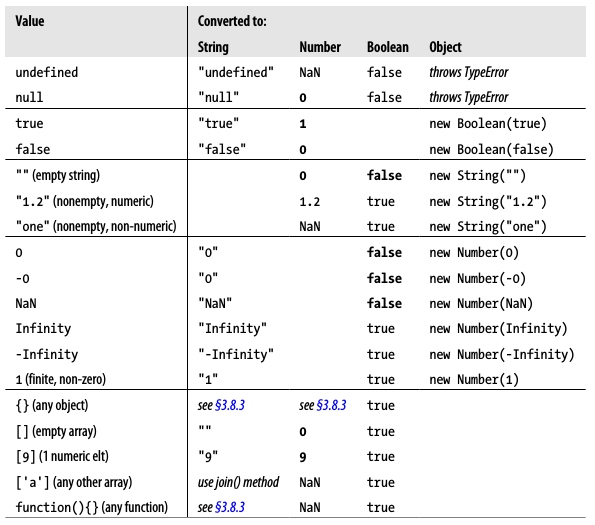

## 第三章 类型、值和变量

### 原始值相互转换



### 对象转换为原始值

* "+"\"=="\关系运算符会

### 作用域链

函数定义的时候保存了一个作用域链，当这个函数被调用，它创建了一个新的对象来存储它的本地变量，并把这个本地变量添加到它保存的作用域链上。

对于嵌套函数，每次外部函数被调用，内部函数都会重新定义。因为每次调用外部函数的作用于链都有所区别（外部函数会重新定义对象？），内部函数的代码都一样，但是相应的作用域链也有所区别。

- 在最顶层代码中，作用域链由一个全局对象组成。


- 在不包含欠他的函数体内，作用域链上有两个对象，第一个是定义函数参数和局部变量的对象，第二个是全局对象。
- 在一个嵌套的函数体内，作用域链上至少有三个对象。

----

## 第四章 表达式和运算符

### 属性访问表达式

* 语法

  ```
  expression . identifier
  expression [ expression ]

  ```

* 说明

  不论使用哪种语法，.和[之前的表达式先计算，如果结果为null或undefined，表达式会抛出一个类型错误异常。运算结果不是对象或数组，js会将其转换为对象。如果对象表达式后跟随句点和标识符，会查找这个标识符指定的属性值，并将其作为整个表达式的返回值。若对象表达式后跟随一对方括号，则会计算方括号内的表达式的值并将它转换为字符串。如果命名属性不存在，那么整个属性访问表达式的值就是undefined。

### 调用表达式

方法内的this可以调用其宿主对象。

### 左值

左值：在一个赋值表达式中能合法出现在左侧表达式。变量、对象属性、数组元素均是左值。

### 关系表达式

* javascript对象的比较是引用的比较，不是值的比较。对象和其本身是相等的，但和其他任何对象都不相等。几遍两个不同的对象具有相同数量的属性、属性名和值，也不相等。

* 字符串比较函数——String.prototype.localeCompare

  ```
  'a'.localeCompare('a');
  //0
  'a'.localeCompare('b');
  //-1
  'b'.localeCompare('a');
  //1

  ```

* 比较操作符的操作数可以是任意类型，但是只有数字和字符串才能真正执行比较操作，因此不是数字和字符串的操作数都将进行类型转换。

### instance运算符

左操作数是一个对象，右操作数是标识对象的类。如果左操作数不是对象，instance返回false，如果右操作数不是函数，则抛出一个类型错误异常。

### 逻辑或

用来给参数提供默认值：

```
// Copy the properties of o to p, and return p
function copy(o, p) {
p = p || {}; // If no object passed for p, use a newly created object.
// function body goes here
}
```

### 逻辑非

逻辑非总是返回布尔值，运作过程是：1.现将某个值转换为对应的布尔值；2.求反。使用它得到某个值的等价布尔值：`!!x`

### 运算符的副作用

赋值运算符、“++”运算符、“--”运算符、delete运算符、函数调用表达式以及对象创建表达式都有副作用。

### delete运算符

* 当删除一个属性，属性不再存在，读取这个不存在的属性返回undefined，使用in运算符返回false；
* 当删除一个数组元素，使用in运算符返回false，但数组长度没有改变；
* 当delete的操作数不是左值时，delete不进行任何操作同时返回true；
* 删除成功返回true;
* 内置核心和客户端属性不能删除，var声明的变量不能删除，function语句定义的函数和函数参数不能删除；
* 严格模式下，操作数非法会抛出一个语法错误异常；
* 严格模式下，删除不可配置的属性会抛出一个类型错误异常。

### void运算符

* void放在操作数前，操作数会照常计算，但是忽略计算结果，返回undefined。
* 通常使用： `<a href="javascript:void window.open();">Open New Window</a>`

### 逗号运算符

* 总是会计算左侧的表达式，但计算结果会忽略掉。

* 应用：

  1. for循环

     ```
     for (var i = 0, j = 9; i <= 9; i++, j--) 
       document.writeln("a[" + i + "][" + j + "] = " + a[i][j]);
     ```

  2. 处理之后返回

     ```
     function myFunc () {
       var x = 0;

       return (x += 1, x); // the same of return ++x;
     }
     ```


----

## 第五章 语句

* 语句和表达式的区别： 表达式计算出一个值，语句用来执行以使事件发生。

### 空语句

`for(i = 0; i < a.length; a[i++] = 0) ; /* empty *///初始化一个数组 `使用空语句最好添加说明注释。

### var

*  var声明的变量无法通过delete删除
*  可以多次声明同一个变量

### function

* 函数声明语句和函数定义表达式的区别：函数声明语句定义的函数对象函数名和函数体都会被提升到最前面，函数声明语句前的代码可以调用该函数；函数定义表达式只有函数名被提升。
* 函数声明语句声明的函数不能使用delete删除，但可以修改。


### switch

每次执行switch时，不是所有的case表达式都能执行到，因此，应当避免使用带有副作用的case表达式，比如函数调用表达式和赋值表达式。最安全的做法是在case表达式中使用常量表达式。

### 使用for/in给一个数组赋值

```
var o = {x:1, y:2, z:3};
var a = [], i = 0;
for(a[i++] in o);
```

### for/in

for/in循环不会遍历对象的所有属性（包括自有属性和继承属性），只有可枚举的属性才会遍历到。内置方法、一些内置对象不可枚举。自定义属性、方法均可枚举

### break&continue

continue：终止本次循环的执行并开始下一次循环的执行，只能在循环体内使用

break：单独使用的作用是立即退出最内层的循环或switch语句。break的控制权无法突破函数的范围。

### return语句

return语句单独使用时，函数也会向调用程序返回undefined。

### throw语句

如果抛出异常的函数没有处理它的try/catch/finally语句，异常将向上传播到调用该函数的代码。异常将沿着js方法的词法结构和调用栈向上传播。如果没有找到任何异常处理程序，js会把异常当成程序错误来处理，并报告给用户。

### try/catch/finally

finally:如果finally从句抛出一个异常，这个异常将替代正在抛出的异常。如果finally从句运行到了return语句，尽管已经抛出了异常且这个抛出的异常还没有处理，这个方法依然会正常返回。

----

## 第六章 对象

- 模拟原型继承

  该函数一个用途是防止库函数无意间修改不受控制的对象。

  ```
  function inherit(p){
    if(p == null) throw TypeError();
    if(Object.create)
    	return Object.create(p);
    var t = typeof p;
    if(t !== 'object' && t !== 'function') throw TypeError();
    function f(){};
    f.prototype = p;
    return new f();
  }
  ```

  ​

- 访问属性

  - []运算符使用字符串值，**字符串值是动态的，可以在运行时更改**。动态访问或设置属性要使用这种方法。
  - .运算符使用标识符，**标识符是静态的，必须写死在程序中**。

- 属性访问

  - 查询属性会涉及到继承，设置属性与继承无关；

  - 属性访问错误：

    - 查询一个不存在的属性不会报错；
    - 查询一个不存在对象的属性报错；
    - 查询值为undefined或null的属性报错。

  - 查询属性避免报错的方法：

    ```
    var len = undefined;
    if(book){
      if(book.subtitle) len = book.subtitle.length;
    }
    ```

    或

    ```
    var len = book && book.subtitle && book.subtitle.length;
    ```

  - 属性设置报错：

    - 给null、undefined设置属性会报**类型错误** ；
    - 给只读属性重新赋值操作会失败，但不会报错。严格模式下，任何失败的属性设置操作都会抛出一个类型错误异常。

- 删除属性

  - **delete只是断开属性和宿主对象的联系**，不会删除属性值(属性的属性)；
  - 只能删除自有属性，不能删除继承属性；
  - 为了避免内存泄露，在销毁对象的时候，要遍历**属性中的属性**，依次删除。
  - 不可配置的属性不能删除，全局变量不能删除，全局函数不能删除。

- 属性检测

  - in：自有属性、继承属性均可以

  - hasOwnProperty()：只能自有属性

  - propertyIsEnumerable()：自有且可枚举的属性

  - !==：可以区分null和undefined

    ```
    if(o.x != null) o.x *= 2;//如果o中含有属性x，且x的值不是null或undefined，o.x乘以2。
    //这个例子中，使用了！=，而不是！==，不需要严格区分
    if(o.x) o.x *= 2;//如果x是undefined、null、false、“ ”、0或NaN，则它保持不变。
    ```

  - Object.keys()：返回一个由对象中可枚举的自有属性的名称组成的数组

  - Object.getOwnPropertyNames()：返回所有自有属性的名称，不仅仅是可枚举属性

- 存取器属性（对应的叫数据属性）

  由getter或setter定义的属性叫做存取器属性，就是属性值由函数方法来替代。**存取器属性可以被继承**

  对象直接量定义存取器属性：

  ```
  //定义
  //格式是一般的属性定义，用get、set替代function
  var o ={
    x: 1.0,
    y: 1.0,
    get r(){return Math.sqrt(this.x*this.x + this.y*this.y);},
    set r(newvalue){
      var oldvalue = Math.sqrt(this.x*this.x + this.y*this.y);
      var ratio = newvalue / oldvalue;
      this.x *= ratio;
      this.y *= ratio;
    },
    get theta(){return Math.atan2(this.y, this.x);}
  }

  //使用
  //存取器属性的继承
  var q = inherit(p);
  q.x = 1, q.y =1;
  console.log(q.r);
  console.log(q.theta);

  ```

- 属性描述符

  - 数据属性特性：值、可写性、可枚举性、可配置性

  - 存取器属性特性：读取、写入、可枚举性、可配置性

  - 获得属性描述符对象：Object.getOwnPropertyDescriptor({x:1}, "x");//只能获得自有属性的描述符。

  - 设置属性特性：Object.defineProperty()，传入要修改的对象、要创建或修改的属性名称、属性描述符对象。不能修改继承属性。会返回修改后的对象，可以这样 var p = Object.defineProperty();

    ```
    var o = {};
    Object.defineProperty(o, "x", {value:1, writable: true, enuerable: false, configurable: true});
    ```

    ​

- 对象属性

  - 原型属性：通过对象直接量创建的对象使用Object.prototype作为它们的原型；通过new创建的对象使用构造函数的prototype属性作为它们的原型；通过Object.create()创建的对象使用第一个参数作为它们的原型。
    - 查看对象原型：Object.getPrototypeOf()
    - 检测一个对象是否是另一个对象的原型：isPrototypeOf()

  - 类属性

  - 可扩展性

    一旦将对象转成不可扩展，就不可逆。

    - Object.esExtensible()：用来判断该对象是否可扩展；
    - Object.preventExtensions(): 将对象转换为不可扩展的，该函数至影响到对象本身的可扩展性。如果给一个不可扩展的对象的原型添加属性，这个不可扩展的对象同样会继承这些新属性。返回传入对象
    - Object.isSealed(): 用来检测对象是否封闭。
    - Objec.seal(): 将对象设置为不可扩展，同时将对象的所有自有属性设置为不可配置（已有属性不能删除或配置，已有可写属性依然可以配置）。返回传入对象。
    - Object.isFrozen(): 用来检测对象是否冻结；
    - Object.freeze():对象设置为不可扩展，其属性设置为不可配置，自有的所有数据属性设置为只读，存取器属性不受影响。返回传入对象。

- 定义在Object.prototype上的对象方法

  - toString()
  - toLocaleString()
  - toJSON()
  - valueOf()


---

## 第七章 数组

- 数组的索引和属性名

  所有的索引都是属性名，但只有0~2^32-2之间的整数属性名才是索引。如果使用的属性是数组的索引，数组的特殊行为就是根据需要封信它们的length属性值。

- 稀疏数组

  索引从0开始但是不连续。

  - 创建稀疏数组：

    在数组直接量中省略值不会创建稀疏数组

    1. `a = new Array(5);//没有元素，但是length为0`

    2. ```
       a = [];//没有元素
       a[1000] = 0;//直接在第1001位置添加一个元素
       ```


- 数组遍历

  - 条件排除

    - 排除null、undefined、不存在的元素

    ```
    for(var i = 0; i < a.length; i++){
      if(!a[i]) continue;
    }
    ```

    - 跳过undefined和不存在的元素

    ```
    for(var i = 0; i < a.length; i++){
      if(a[i] === undefined) continue;
    }
    ```

    - 跳过不存在的元素

    ```
    for(var i = 0; i < a.lenght; i++){
      if(!(i in a)) continue;
    }

    ```

  - for/in循环

    for/in循环能够枚举继承的属性名，如添加到Array.prototype中的方法。因此，数组上不应该使用for/in循环，除非能过滤不必要的属性。

    ```
    for(var i in a){
      if(!a.hasOwnProperty(i)) continue;//跳过继承的属性
    }

    ```

  - 如果算法依赖于遍历的顺序，那么最好不要使用for/in而用常规的for循环。

- 数组方法

  - join()

  - reverse()

  - sort()

  - concat()

  - slice()

  - splice()

  - push()

  - pop()

  - unshift()

  - shift()

  - toString()

  - toLocaleString()

  - forEach()

  - forEach()

  - map()

  - filter()：会跳过稀疏数组中缺少的元素，返回的数组总是稠密的。

    - 压缩稀疏数组的空缺

      ```
      var dense = sparse.filter(function(){return true;});
      ```

    - 压缩空缺并删除undefined和null元素

      ```
      a = a.filter(function(x){return x !== undefined && x !== null;});
      ```

  - every()

  - some()

  - reduce()

  - reduceRight()

  - indexOf()

  - lastIndexOf()

- 判断数组类型

  `Array.isArray()`

- 类数组和字符串调用数组通用方法要借助call()函数。

---

## 第八章函数

函数也是对象，可以把函数赋值给变量，或者作为参数传递给其他函数。可以给它们设置属性甚至调用它们的方法。

- 函数定义

  - 声明语句定义：一条函数声明语句实际上声明了一个变量，并把一个函数对象赋值给它。函数声明语句会被提前，可以在它的定义出现之前调用。
  - 表达式定义：函数名称可选。在递归调用中很有用。函数的名称将会成为函数内部的一个局部变量。在使用一个以表达式方式定义的函数之前，必须要把它赋值给一个变量。函数声明提前了，但是给变量赋值不会提前，所以以表达式方式定义的函数在定义之前无法调用。

- 函数调用

  方法调用和函数调用的重要区别：调用上下文。在方法调用表达式里，对象成为调用上下文，函数体可以使用关键字this引用该对象。

  - 方法链：方法的返回值是一个对象，这个对象还可以再调用它的方法。当方法不需要返回值时，最好直接返回this。**不要将方法的链式调用和构造函数的链式调用混为一谈。**
  - 分类：
    - 作为函数调用
    - 作为方法调用
    - 作为构造函数调用
    - 通过call()、apply()方法间接调用

- this

  this是一个关键字，不是变量也不是属性名，不允许赋值，也没有作用域的限制，嵌套函数不会从调用它的函数中继承this。

  - 如果嵌套函数作为方法调用，this值指向调用它的对象；
  - 如果嵌套函数作为函数调用，this值不是全局对象就是undefined；
  - 如果想访问外部函数的this值，需要将this的值保存在一个变量里，这个变量和内部函数都在同一个作用域内。`var self = this;` 。

- 形参对象

  通过实参名称修改参数，arguments[]也可以获取到修改后的值,vice versa。es5中取消了参数对象的这个特殊性

- 立即执行的匿名函数:使用圆括号javascript解释器才会正确地将其解析为函数定义表达式。

- 闭包:

  This combination of a function object and a scope in which the function's vatiables are resolved is called a closure in the computer science literature.

  Technically, all js functions are closures: they are objects, and they have scope chain associated with them.

  Most functions are invoked using the same scope chain that was in effect when the function was defined and it doesn't really matter that there is a closure involved.

  Javascript functions are executed using the scope chain that was in effect when they were defined.

  - 作用域链：作用域链被描述为一个对象列表。每次一个函数被调用，一个新的对象被添加进这个作用域链中，当这个函数返回的时候，绑定内部变量的对象就从作用域链中被移除，被垃圾回收。

- 函数间接调用

  任何函数可以作为任何对象的方法来调用，哪怕这个函数不是那个对象的方法。​

- bind()

  当在函数上调用bind方法并传入一个对象最为参数，这个方法将返回一个新的函数。调用新的函数将会把原始的函数当做传入对象的方法来调用。传入新函数的任何实参都将传入原始函数。

  ES3版本的Function.bind()方法

  ```
  //定义
  if(!Function.prototype.bind){
    Function.prototype.bind = function(o/*,args*/){
      var self = this, boundAgrs = arguments;
      return function(){
        var args = [], i;
        for(i = 1; i < boundArgs.length; i++) args.push(boundArgs[i]);
        for(i = 0; i < arguments.length; i++) args.push(arguments[i]);
        return self.apply(o, args);
      }
    }
  }

  //使用
  function f(y, z){return this.x + y +z}
  var g = f.bind({x:1}, 2);
  g(3);
  ```

- toString()

  1. 对象类的toString()方法：Object.prototype.toString.call(?) => [object Function]
  2. 函数类的toString()方法：Function.prototype.toString.call(?) => 函数体的字符串

---

## 第九章 类和模块

- instance检测某个对象是否属于某个类

  `r instanceof Range`

  **实际上instance运算符不会检查r是否是由Range()构造函数初始化而来，而会检查r是否继承Range.prototype。**

- prototype属性

  每个javascript函数**（bind（）方法返回的函数除外）**都自动拥有一个prototype属性。

- constructor属性

  - prototype属性值是一个对象，这个对象包含为一个不可枚举属性constructor，constructor属性值的值是一个函数对象。

  - 构造函数创建的对象继承了这个constructor属性，因此，

    ```
    var o = new F();
    o.constructor === F;//true
    ```

- 原型重写

  使用对象字面量会重写预定义的原型对象，这个新定义的原型对象不含有constructor属性，因此由它的构造函数定义的对象也不会继承到这个constructor，只能显示给原型添加一个构造函数。

  ```
  Range.prototype = {
  constructor: Range, // Explicitly set the constructor back-reference
  includes: function(x) { return this.from <= x && x <= this.to; },
  foreach: function(f) {
  for(var x = Math.ceil(this.from); x <= this.to; x++) f(x);
  },
  toString: function() { return "(" + this.from + "..." + this.to + ")"; }
  };
  ```

  ​

- 使用预定义的原型对象

  预定义的原型对象包含constructor属性，不需要显示创建。要使用对象属性的形式赋值。

  ```
  Range.prototype.includes = function(x) { return this.from<=x && x<=this.to; };
  Range.prototype.foreach = function(f) {
  for(var x = Math.ceil(this.from); x <= this.to; x++) f(x);
  };
  Range.prototype.toString = function() {
  return "(" + this.from + "..." + this.to + ")";
  };
  ```

  ​

- 类的扩充

  - 模拟es5中的String.trim()

    ```
    String.prototype.trim = String.prototype.trim || function(){
      if(!this) return this;
      return this.replace(/^\s+|\s+$/g, "");
    };
    ```

  - 可以给Object.prototype添加方法，从而是所有的对象都可以调用这些方法。但在es5之前，无法将这些新增的方法设置为不可枚举的，这些属性是可以被for/in循环遍历到的。可以通过Object.defineProperty()方法安全的扩充，*但不是所有的宿主环境都可以使用这个方法（这是啥意思？）*。

- 检测对象的类

  1. instanceof运算符

     计算过程实际上是检测了对象的继承关系，而不是检测创建对象的构造函数。

  2. 使用constructor

     使用constructor属性检测对象属于某个类的技术的不足之处和instance一样。在多个执行上下文的场景中它是无法正常工作的（比如在浏览器窗口的多个框架子页面中）

  3. 使用构造函数的名称

     不是所有的对象都有constructor属性。此外，不是所有的函数都有名字。

- 工厂方法

  每次调用都会创建并返回一个新的类。

- 关于9-6、9-7以及9-8三个例子的想法

  1. 关于构造函数、对象原型、对象实例三个各自属性的类别

     - 构造函数

       1. 定义在构造函数中的属性一般是用来初始化状态的属性,通常使用this.xx。
       2. 使用对象（构造函数）[属性]形式添加值
       3. 使用对象（构造函数）[属性]形式添加的函数通常用来起辅助作用，不直接操作对象实例的属性。

     - 对象原型

       定义在对象原型上，用来被对象实例继承，直接操作对象实例的值，通常使用this.xx

     - 对象实例

- 自定义对象通常要包含自定义的转换方法

  - toString()：会自动调用
  - toLocaleString()：会自动调用
  - valueOf()：会自动调用
  - toJSON()：如果一个对象有toJSON（）方法，JSON.stringigy()不会对传入的对象做序列化操作，而会调用toJSON（）来执行序列化操作。

- 集合类

  集合类是一种数据结构，用以表示非重复值的无序集合。集合的基础方法包括添加值、检测值是否在集合中。

- 枚举类型

  它是值的有限集合，如果值定义为这个类型，则值是可列出的。

- 私有状态

  在构造函数中，使用闭包来访问属性。这样做会占用更多内存，运行速度更慢。**半懂**

- 构造函数的重载和工厂方法

  **没懂**

---

## 第10章 正则表达式

- 直接量字符

  如果不记得哪些标点符号需要反斜线转义，可以在每个标点符号前都加上反斜线。

- 字符类

  将直接量字符单独放进方括号内就组成了字符类。一个字符类可以匹配它所包含的任意字符。

  - `/[abc]/`匹配abc中的任意一个。
  - 否定字符类：`/[^abd]/`匹配abc之外的所有字符。
  - 连字符表示范围：`/a-zA-Z0-9/`匹配拉丁字母表中的任何字母和数字。
  - **正则表达式的模式匹配总是会寻找字符串中第一个可能匹配的位置。**

- 选择

  选择项的尝试匹配次序是从左到右。如果左边的选项匹配，就忽略右边的匹配项。

- 圆括号

  1. 把单独的项组合成子表达式，以便可以像处理一个独立单元那样用|*+?等来对单元内的项进行处理。
  2. 在完整的模式中定义子模式。在匹配的结果中，将子模式抽取出来。
  3. 允许在同一个正则表达式的后部引用前面的子表达式。对这个表达式的引用，不是指对子表达式模式的引用，而指的是与那个模式相匹配的文本的引用。引用可以用于实施一条约束，即一个字符串各个单独部分包含的是完全相同的字符。\1
  4. （?:...）只组合，把项组合到一个单元，但不记忆与该组相匹配的字符，且不编码。

- 锚元素

  ^：匹配字符串的开始

  $：匹配字符串的结束

  \b：匹配单词的边界

  \B：匹配不是单词的边界之处

  (?=\:)：先行断言，只有在正则表达式之后有冒号时才能匹配

  (?! Script)：负向先行断言，用以指定接下来的字符都不必匹配。`/Java(?! Script)([A-Z]\w*)/`可以匹配JavaScript，但不能匹配Javascripter

- string的四种正则表达式的方法

  1. search()：它的参数是一个正则表达式，返回一个与之匹配的子串的起始位置，如果找不到匹配的子串，将返回-1。不支持全局检索，忽略g。第一个参数如果不是正则表达式，则调用RegExp构造函数将它转换成正则表达式。

  2. replace()：

     1. 执行检索与替换。第一个参数是一个正则表达式，第二个参数是要进行替换的字符串。第一个参数不是正则表达式也不会使用RegExp构造函数进行转换。 

     2. 在替换字符串中出现$加数字，那么replace()将用与制定的子表达式相匹配的文本来替换这两个字符。

        ```
        var quote = /"([^"]*)"/g;
        text.replace(quote, '“$1”')
        ```

     3. replace的第二个参数可以是函数。

  3. match()

     唯一参数是一个正则表达式，返回一个由匹配结果组成的数组。如果正则表达式没有设置修饰符g，match（）不会进行全局检索，它只检索第一个匹配，同样返回一个数组，第一个元素是匹配的字符串，余下的元素则是正则表达式中用圆括号括起来的子表达式。当match()的参数是一个全局正则表达式时，它返回由匹配结果组成的数组。

  4. split()

     参数可以是一个正则表达式，比如xxx.split(/\s * ,\s * /)允许两边可以留有任意多的空白符。

- RexExp构造函数在需要动态创建增则表达式的时候非常有用，例如待检索的字符串是由用户输入的，就必须使用这个构造函数，在程序运行时创建正则表达式。

  **ES5中，正则表达式直接量的每次计算都会创建一个新的RegExp对象，每个新的RegExp对象具有各自的lastIndex属性。**

  1. exec()

     参数是一个字符串，没有找到任何匹配返回null，如果找到一个匹配则返回一个数组，第一个元素包含的是与正则表达式相匹配的字符串，余下的元素是与圆括号内的子表达式相匹配的子串。属性index包含了发生匹配的字符的位置，属性input引用的是正在检索的字符串。

     当调用这个函数的正则表达式对象具有全局修饰符时，它将把当前正则表达式对象的lastIndex属性设置为紧挨着匹配子串的字符位置。当同一个正则表达式第二次调用exec()时，它将从lastIndex属性所指示的字符处开始检索。

     当没有发现任何匹配结果，这个函数会将lastIndex重置为0。**lastIndex可以手动设为0。**

  2. test()

     和exec()类似，当exec()的返回结果不是null时，test()返回true。可以用来遍历字符串。

---


## 第13章 Web浏览器中的javascript

- window对象：表示web浏览器的一个窗口，可以用标识符window来引用。window对象是全局对象，它的属性和方法是全局变量和全局函数。alert（）、setTimeout（）方法，不需要显示使用window。

- document对象：window对象的属性，引用Document对象，表示在窗口中的文档。

  - getElementById()方法是定义在document对象上的
    - getElementById方法返回的Element对象上定义有其他属性和方法，比如
      1. 这类属性和方法：firstChild属性、appendChild()方法；
      2. 控制css的属性和方法：style、className属性

- Window、Document、Element对象上另一个重要的属性集合是事件处理程序相关的属性。可以在脚本中为之绑定一个函数，这个函数会在某个时间发生时以异步的方式调用。

- 全局window对象以及不同窗口和窗体之间的交互

  1. web页面中所包含的所有js代码共用同一个全局window对象。这意味着它们都可以看到相同的Document对象，可以共享相同的全局函数和变量的集合：如果一个脚本定义了新的全局变量或函数，那么这个变量或函数会在脚本执行之后对任意js代码可见。
  2. 如果web页面包含一个嵌入的窗体(通常使用`<iframe>`元素)，嵌入文档中的js代码和被嵌入文档里的js代码会有不同的全局对象，它可以当做一个单独的js程序。

- javascript程序的执行阶段

  1. 载入文档内容，并执行`<script>`元素里的代码；

  2. 事件驱动的异步阶段

     事件驱动阶段里发生的第一个事件是load事件，指示文档已经完全载入，并可以操作。

- js是单线程执行，同一个时间只能执行一个，没有并发性。

- 如果应用程序不得不执行太多的计算而导致明显的延迟，应该允许文档在执行这个计算之前完全载入，并确保能够告知用户计算正在进行并且浏览器没有挂起。

- HTML5定义了一种并发的控制方式，叫做“web worker”。这是一个用来执行计算密集任务而不冻结用户界面的后台线程。运行这个线程里的代码不能访问文档内容，不能和主线程或其他worker共享状态，只可以和主线程和其他worker通过异步事件进行通信，所以主线程不能检测并发行，并且web worker不能修改js程序的基础单线程执行模型。

##### 事件介绍

- 注册事件处理程序最简单的方法

  ```
  window.onload = function(){};
  document.getElementById("button1").onclick = function(){};
  function headleResponse(){}
  request.onreadystatechange = handleResponse;
  ```

  注意，上面的任何代码里没有函数调用，只是把函数本身赋值给这些属性。浏览器会在事件发生时执行调用。

- 冒泡

  如果用户在`<button>`元素上单机鼠标，单击事件就会在按钮上触发。如果注册在按钮上的函数没有处理该事件，事件会冒泡到按钮嵌套的容器元素，这样，任何注册在容易元素上的单机事件都会调用。

- addEventListener()函数

  为一个**事件**注册多个**事件处理程序函数**。？？？？？


##### js在浏览器中的兼容性问题

- 使用类库

- 分级浏览器支持

- 功能测试

- 渲染模式

  渲染模式的选择依赖于HTML文件顶部的DOCTYPE声明，定义了HTML5（<!DOCTYPE html>）的页面在所有现代浏览器中都会按照标准模式渲染。

  进行渲染模式的特性检测，通常检查document.compatMode属性。如果其值为"CSSCompat"，说明浏览器工作在标准模式；如果值为"BackCompat"（或undefined，说明属性根本不存在），则说明浏览器工作在怪异模式

- 浏览器测试-客户端嗅探，根据不同的浏览器使用不同的js代码

- IE里的条件注释


##### 同源策略

web页面使用多个`<iframe>`元素或者打开其他浏览器窗口时，**脚本只能读取和所属文档来源相同的窗口和文档的属性。**

**！！！脚本本身的来源和同源策略并不相关，相关的是脚本所嵌入的文档的来源。！！！**

- 不严格的同源策略
  - 设置document对象的origin属性
  - CORS
  - 跨文档消息

##### 跨站脚本（XSS）

指攻击者向目标web站点注入HTML标签或者脚本。

- 防范：
  - 通常，防止XSS攻击的方式是，在使用任何不可信的数据来动态创建文档内容之前，从中移除HTML标签`name = name.replace(/</g, "&lt;").replace(/>/g, "&rt;");`
  - HTML5的内容安全策略为`<iframe>`元素定义了一个sandbox属性。在实现后，它允许显示不可信的内容，并自动禁用脚本。


---

## 第十四章 window对象

- [队列](https://johnresig.com/blog/how-javascript-timers-work/)

  Intervals don’t care about what is currently executing, they will queue indiscriminately, even if it means that the time between callbacks will be sacrificed.

  intervals不在乎当前有什么正在执行，时间到了就会无差别的排队，即使用掉回调间隔的时间也会排队。

  If you were to queue up all interval callbacks when a large block of code is executing the result would be a bunch of intervals executing with no delay between them, upon completion. Instead browsers tend to simply wait until no more interval handlers are queued (for the interval in question) before queuing more.

  如果你打算在一大段代码正在执行时，将所有的interval灰调函数排进队列，结果就是这些interval无间隔的连续执行，直到结束。**取而代之的是，浏览器倾向于简单的处理，如果队列中有interval在排队，就不在接受更多的interval回调代码进入队列。**

  - js引擎单线程工作，强迫所有异步事件排队等待执行；
  - setTimeout和setInterval在执行异步代码上有本质的不同；
  - 如果一个timer没有立刻执行，它一定会延迟到下一个可以执行的点上（推迟的事件或许比设置的期望时间要长）；
  - intervals如果等待了很长时间才执行，那可能会出现多个interval异步代码紧挨着，没有间隔的执行。

- 浏览器的定位和导航

  - window对象的location属性引用的是Location对象，它**表示该窗口中当前显示的文档的URL**，并定义了方法来使窗口载入新的文档。

  - URL分解属性：protocol、host、hostname、port、pathname、search。被`<a> `标签支持

  - Document对象的location属性也引用到Location对象

  - window.location === document.location //true window对象的一个属性是document，引用Document对象，表示显示在窗口中的文档。

  - document的URL属性，是文档首次载入后保存该文档的URL的静态字符串。location属性会随着页面跳转而改变，URL属性不会改变。

  - hash属性返回URL中的**片段标识符部分** 。

  - search属性返回问号之后的URL，这部分通常是某种类型的查询字符串。

  - 客户端javascript定义的一个全局函数：decodeURIComponent()

  - [String.prototype.substring()](https://developer.mozilla.org/zh-CN/docs/Web/JavaScript/Reference/Global_Objects/String/substring)

    返回一个字符串在开始索引到结束索引之间的一个子集, 或从开始索引直到字符串的末尾的一个子集。

    indexend参数可选，不包括这个位置。

  - [String.prototype.split()](https://developer.mozilla.org/zh-CN/docs/Web/JavaScript/Reference/Global_Objects/String/split)

    使用指定的分隔符字符串将一个[`String`](https://developer.mozilla.org/zh-CN/docs/Web/JavaScript/Reference/String)对象分割成字符串数组，以将字符串分隔为子字符串，以确定每个拆分的位置。

- 载入新文档

  - location.assign()：使窗口载入并显示制定的URL中的文档。

  - location.replace()：和assign（）方法类似，但在载入新文档之前会从浏览历史中把当前文档删除。

    `if(!XMLHttpRequest)location.replace('staticpage.html');//如果浏览器不支持XMLHttpRequest对象，则将其重定向到一个不需要Ajax的静态页面`

    staticpage.html是一个相对URL。相对URL是相对于当前页面所在的目录来解析的。

  - location.reload()：让浏览器重新载入当前文档。

  - 直接把新的URL赋值给location属性，可以是绝对URL，也可以是相对URL

  - location的URL分解属性是可写的，对它们重新赋值会改变URL的位置，并导致浏览器载入一个新的文档

    `location.search = "?page=" + (pagenum + 1);//载入下一个页面`

- *错误处理*

  *window对象的onerror属性是一个事件处理程序，当未捕获的异常传播到调用栈上时就会调用它，并把错误消息输出到浏览器的JavaScript控制台上。如果给这个属性赋一个函数，那么只要这个窗口中发生了Javascript错误，就会调用该函数，它成了窗口的错误处理程序。*

  *window对象的onerror事件处理函数的三个参数：*

  1. *描述错误的一条消息；*
  2. *一个字符串，存放引发错误的javascript代码所在的文档的URL；*
  3. *文档中发生错误的行数*

- *作为window对象属性的文档元素*

  *如果在html文档中用id属性来为元素命名，并且如果window对象没有此名字的属性，window对象会被赋予一个属性，它的名字是id属性的值，而它们的值指向表示文档元素的HTMLElement对象。*

- 窗口和窗体

  每一个标签页都是独立的“浏览上下文”，每一个上下文都有独立的window对象，相互之间互不干扰。

  - Window.open()载入指定的URL到新的或已存在的窗口中，并返回代表那个窗口的window对象。

    可选参数：

    1. URL：要在新窗口中显示的文档的URL。如果这个参数省略了，也可以是空字符串，那么会使用空页面的URL about：blank。

    2. 第二个参数是新打开窗口的名字。

       当且仅当窗口包含的文档来自相同的源或者是这个脚本打开了那个窗口，脚本才可以只通过名字来制定存在的窗口。

       如果其中一个窗口是内嵌在另一个窗口里的窗体，那么在它们的脚本之间就可以相互导航。这种情况下，可以使用保留的名字“_top”(顶级窗口)和" _parent"(直接父级窗口)来获取彼此的浏览上下文。

    3. 第三个从参数是一个以逗号分隔的列表，包含大小和各种属性，用以表明新窗口是如何打开的。

    4. 第四个参数只在第二个参数命名的是一个存在的窗口时才有用。它是一个布尔值，声明了由第一个参数指定的URL是应用替换掉窗口浏览历史的当前条目，还是应该在窗口浏览历史中创建一个新的条目，后者是默认的设置。

  - Window.close()

    1. 对于已创建的window对象w，可以使用`w.close();`将其关闭；
    2. 运行在那个窗口中的js代码可以使用`window.close();`将其关闭；
    3. 即使关闭一个窗口，代表它的window对象依然存在。已关闭的窗口会有个值为true的closed属性，它的document会是null，它的方法通常也不会再工作。

  ---

  ​

## 第十四章 脚本化文档

- Document对象:getElementById()、getElementsByTagName()、getElementsByClassName()

- Element对象:getElementsByTagName()、getElementsByClassName() 

- HTMLDocument对象:getElementsByName()

  **以上方法返回的结果是一个NodeList对象**

- HTMLDocument对象:

  - document.body 对应 一个html文档的`<body>`
  - document.head 对应 一个html文档的`<head>`

- Document对象:

  - documentElement 指代文档根元素`<html>`

- HTMLDocument对象:

  - document.images
  - document.forms

  **以上两个属性返回一个HTMLCollection对象**

- 实时性

  - NodeList对象和HTMLCollection对象的状态时实时的，当文档变化时，他们所包含的元素列表也随之改变；

  - 如果要迭代这两个对象时，在文档中添加或删除元素，首先要对它们生成一个静态副本

    `var snapshot = Array.prototype.slice.call(nodelist, 0);`

- Node对象的属性**（具有实时性）**

  1. parentNode
  2. childNodes:只读的NodeList对象，是该节点子节点的实时表示
  3. firstChild、lastChild
  4. nextSibling、previousSibling
  5. nodeType:该节点的类型。9表示Document节点，1表示Element节点，3表示Text节点，8表示Comment节点，11表示DocuemntFragment节点。
  6. nodeValue：text节点或comment节点的文本内容
  7. nodeName：元素的标签名，以大写形式表示

- children属性：

  Element对象的一个属性，类似ChildNodes，是一个NodeLIst对象，但只包含Element对象，非标准属性

- Element属性：

  firstElementChild、lastElementChild，类似上述3，但只代表子element

  nextElementSibling、previousElementSibling，类似上述4，但只代表兄弟兄弟Element

  childElementCount：子元素的数量，等于children.length

- html元素的属性在js中

  - 使用小写形式
  - 属性名包含不止一个单词使用驼峰形式
  - html的属性名在js中是保留字的，在js中使用时要加上html前缀，className对应class，是个特例。

- 定义在Element对象上的方法

  - getAttribute()

  - setAttribute()

  - hasAttribute()

  - removeAttribute()

    **这些方法中属性值都被看做字符串；方法使用标准属性名。**前两个可以用来查询和设置非标准html属性

- 非标准属性要以data-开头，成为数据集属性，以不破坏html元素的合法性。

- attributes属性时只读的类数组对象，实时的，定义在Node上，针对Element对象生效

  得到的值时Attr对象，是一类特殊的Node，Attr的name和value属性返回该属性的名字和值。

- 设置innerHTML的效率非常高，甚至在指定的值需要解析时效率也很不错。但是！对innerHTML属性用**“+=”操作符重复追加**一小段文本效率低下。

- 使用outerHTML替换节点后，被替换的节点不再在页面中显示，但还存在与内存中。

- insertAdjacnetHTML:位置包含beforebegin,afterbegin,beforeend,afterend，可以在上述四个位置处插入元素标签

- 获取纯文本

  - 非ie用textContent，性能好，防止xxs攻击
  - ie用innerText
  - 区别：[点击此处](https://developer.mozilla.org/zh-CN/docs/Web/API/Node/textContent)

- 创建、插入和删除节点

  - 创建节点

    document.createElement():定义在Document对象上，给方法传递元素的标签名

    document.createTextNode():定义在Document对象上，给方法传递字符串形式的文本内容

    document.createComment(): 定义在Document对象上

    cloneNode():返回某个节点的全新副本。给方法传递参数true，递归的复制所有的后代节点，false执行一个浅复制。定义在node上？

    importNode（）：定义在Document对象上，支持除ie外的其他浏览器。如果给它传递另一个文档的一个节点，它将返回一个适合本文档插入的节点的副本。传递true作为第二个参数，该方法将递归地导入所有的后代节点。

  - 插入节点

    appendChild():定义在Node上的方法，在需要插入的Element节点上调用，它插入指定的节点使其成为那个节点的最后一个子节点。

    insertBefore():类似appendChild()，接受两个参数，第一个参数时待插入的节点，第二个参数已存在的节点，新节点将插入该节点的前面。在新节点的父节点上调用。如果第二个参数为null，这个方法类似于appendChild，它将节点插入在最后。

    如果调用appendChild或insertBefore将已存在文档中的一个节点再次插入，那个节点将自动从它当前的位置删除并在新的位置重新插入。

- 文档和元素的几何形状和滚动

  元素的位置时以像素来衡量的，向右代表x坐标的增加，向下代表y坐标的增加。

  **文档坐标系**：以文档左上角为原点——元素的x和y坐标相对于文档的左上角；

  **视口坐标系**：以显示文档的视口左上角为原点——元素的x和y坐标相对于视口的左上角。

  ​

  - 文档和视口坐标系统重叠：如果文档比视口要小，或者它还没有出现滚动。

  - 在文档和视口坐标系统中切换：加上或减去滚动的偏移量。

  - 当为鼠标事件注册时间处理程序函数时，报告的鼠标指针的坐标时在视口坐标系统中的。

  - 判断浏览器窗口滚动条的位置(**视口坐标系统**)

    - 定义在window对象上的（≤ie8除外）

      - pageXOffset
      - pageYOffset

    - 正常模式下

      定义在document.documentElement上

      - scrollLeft
      - scrollTop

    - 怪异模式下

      定义在document.body上

      - scrollLeft
      - scrollTop

  - 查询视口的尺寸（**视口坐标系统**）

    - 定义在window对象上的（≤ie8除外）

      - innerWidth
      - innerHeight

    - 标准模式下

      定义在document.documentElement上

      - clientWidth
      - clientHeight

      这两个属性类似offsetWidth和offsetHeight，但client系列的只包含内容和它的内边距。如果浏览器在内边距和边框之间添加了滚动条，clientWidth和clientHeight在其返回值中也不包含滚动条。会舍入为一个整数。对于i、span、code这种内联元素，clientWidht和clientHeight总是返回0。在文档的根元素上这两个属性的返回值和窗口的innerWidth和innerHeight属性值相等。

    - 怪异模式下

      定义在document.body上，只读

      - clientWidth
      - clientHeight

  - getBoundingClientRect()——查询一个元素尺寸和位置最简单的方法

    不需要参数，返回一个有left、right、top、bottom、width、height属性的对象。left和top属性表示元素的左上角的x和y坐标，right和bottom属性表示元素的右下角的x和y坐标。

    **视口坐标系统。**

    **返回的坐标包含元素的内边距和边框，不包含外边距**

    **对于内联元素，如果这个元素跨越两行，这个方法返回的边界矩形会包含整整两行的宽度。**

    **不会实时更新**

    ```
    视口坐标系统转换为文档坐标系统
    var box = e.getBoundClientRect();
    var offsets = getScrollOffsets();
    var x = box.left + offsets.x;
    var y = box.top + offsets.y;

    计算元素尺寸
    var box = e.getBoundingClientRect();
    var w = box.width || (box.right - box.left);
    var h = box.height || (box.bottom - box.top);
    ```

  - getClientRects()——查询内联元素每个独立的矩形

    **不会实时更新**

    该方法返回一个只读的类数组对象，每个元素都是一个关于矩形对象的相关属性。比如上述的跨越两行的内联元素，会返回两个矩形。

  - 滚动

    - 定义在Window对象上的scrollTo()，接受一个点的x和y坐标（**文档坐标系统！！！**），窗口滚动到指定的点出现在视口的左上角。
    - 定义在HTML元素上的scrollIntoView()，保证元素在视口中可见。默认情况下，它将试图将元素的上边缘放在或尽量接近视口的上边缘。如果只传递false作为参数，它将试图将元素的下边缘放在或尽量接近视口的下边缘。只要有助于元素在视口内可见，浏览器也会水平滚动视口。

  - offset系列查询元素的位置和尺寸

    - offsetWidth和offsetHeight：任何HTML元素的只读属性offsetWidth和offsetHeight以css像素返回它的屏幕尺寸。**返回的尺寸包含元素的边框和内边距，除去外边距。**

    - offsetLeft和offsetTop：返回元素相对于offsetParent的x和y坐标，如果offsetParent为null，则这两个属性是文档坐标。

    - offsetParent：指定元素的offsetLeft和offsetTop所相对的父元素。

      ```
      此函数计算指定元素的文档坐标
      当文档包含可滚动的且有溢出内容时，此方法无法正常工作，因为没有把滚动条考虑进来。
      function getElementPosition(e){
        var x = 0, y = 0;
        while(e != null){
          x += e.offsetLeft;
          y += e.offsetTop;
          e = e.offsetParent;
        }
        return {x: x, y: y};
      }
      ```

      ​

  - scrollWidth和scrollHeight

    元素的内容区域加上它的内边距，再加上溢出内容的尺寸（比如滚动条）

  - scrollLeft和scrollTop

    可读写，指定元素的滚动条的位置，通过设置这两个属性可以让元素在其中滚动。（HTML元素没有类似window对象的scrollTo（）方法）

- [querySelectorAll](https://developer.mozilla.org/zh-CN/docs/Web/API/Document/querySelectorAll)
  - 返回一个**静态**NodeList类型
  - 接受的参数是由逗号分割的css选择器
  - 使用深度优先遍历

此章未结束，待续

---

## 第十六章 脚本化css

- `父元素 position:relative;left:0;top:0;`

  ```
  假设父元素position: relative; 有padding的状态下：如果有top/left:0 ：子元素紧贴父元素padding的边界（因为父元素包含块的边界就是padding边界）如果没有设置值：子元素紧贴父元素content的边界（其实此时值为auto）
  ```

- 另一种指定元素尺寸的方法是

  - 指定元素宽度：同时指定left和right属性，如果有width属性，则width属性会覆盖right属性
  - 指定元素高度：同时指定top和bottom属性，如果有height属性，则height属性会覆盖bottom属性

- z-index属性

  - 对于定位的重叠元素：当两个或多个元素重叠在一起时，它们按照从低到高的z-index顺序绘制，如果重叠元素的z-index值一样，它们按照在文档中出现的顺序绘制，最后一个重叠的元素显示在最上面，z-index的默认值为0，且z-index只对兄弟元素有效。
  - 对于非定位的元素：总是以防止重叠的方式进行布局，z-index属性不会应用在它们上面。它们默认的z-index的值也是0，z-index为正值的定位元素显示在常规文档流的上面，z-index为负值的定位元素显示在常规文档流的下面。

- 标准的css盒模型规定width和height样式属性给定内容区域的尺寸，并且不包含内边距和边框，可以称此盒模型为内容盒模型。

- 在主流浏览器中已经可以使用不带前缀的box-sizing属性。

- calc（）可以在≥ie9中使用

  `<div style="width: calc(50% - 12px); padding: 10px; border: solid black 2px;">`

  //没有想过要这样使用诶

- visibility和display属性对绝对定位和固定定位的元素的影响等价，因为这些元素不是文档布局的一部分，隐藏和显示定位元素时一般首选visibility属性。

- rgba可以在ie9中使用

- 如果没有为指定背景颜色或图像，它的背景通常透明。

- **ie9不支持opacity属性**

  ```
  //兼容性的使用
  opacity: .75;
  filter: alpha(opacity = 75);//ie下的使用，没有小数点
  ```

  ​

- cssStyleDeclaration对象

  ```
  e.style.fontSize = "24px";
  e.style.fontWeight = "bold";
  e.style.color = "blue";
  //具体样式名中带连字符的换成驼峰写法
  //保留字的前面加上css

  e.style.margin = topMargin + "px " + rightMargin + "px " + bottomMargin + "px " + leftMargin + "px";//必须带单位


  ```

- 通过js查询和设置css样式

  **这两种用法对应内联样式 ，读取不是定义在内联样式的属性值时，会返回空字符串。**

  ```
  设置
  e.setAttribute("style", s);
  e.style.cssText = s;

  查询
  s = e.getAttribute("style");
  s = e.style.cssText;
  ```

- 计算样式
  - 是一个cssStyleDeclaration对象
  - 只读
  - window.getComputedStyle(元素, secondProp);
    其中secondProp必选项,通常是null,空字符串,或者":before",":after",":first-line",":first-letter"