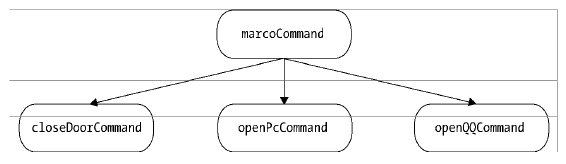

## 第10章 组合模式

使用组合模式的条件：**组合模式除了要求组合对象和叶对象拥有相同的接口之外，还有一个必要条件，就是对一组叶对象的操作必须具有一致性。**

组合模式可以让我们使用树形方式创建对象的结构。我们可以把相同的操作应用在组合对象和单个对象上。在大多数情况下，我们都可以忽略掉组合对象和单个对象之间的差别，从而用一致的方式来处理它们。

组合模式的缺点：它们可能会产生一个这样的系统：系统中的每个对象看起来都与其他对象差不多。它们的区别只有在运行的时候才会显示出来，这会使代码难以理解。此外，如果通过组合模式创建了太多的对象，那么这些对象可能会让系统负担不起。

**在javascript中，我们很多时候不需要实现一个传统的模板方法模式，高阶函数是更好的选择。**就像最后那种实现方式

### 一个宏命令对象的示例

```js
var closeDoorCommand = {
  execute: function() {
    console.log('关门');
  }
};

var openPcCommand = {
  execute: function() {
    console.log('开电脑');
  }
};

var openQQCommand = {
  execute: function() {
    console.log('登录QQ');
  }
};

var MacroCommand = function() {
  return {
    commandsList: [],
    add: function(command) {
      this.commandsList.push(command);
    },
    execute: function() {
      for (var i = 0, command; command = this.commandsList[i++]; ) {
        command.execute();
      }
    }
  };
};

var macroCommand = MacroCommand();

macroCommand.add(closeDoorCommand);
macroCommand.add(openPcCommand);
macroCommand.add(openQQCommand);

macroCommand.execute();
```
这个宏对象形成了一个树形结构：



其中，marcoCommand被称为组合对象，下面三个对象都是叶对象。在macroCommand的execute方法里，并不执行真正的操作，而是遍历它所包含的叶对象，把真正的execute请求委托给这些叶对象。

macroCommand表现的像一个命令，但它实际上只是一组真正命令的 **代理**。并非真正的代理，虽然结构上相似，但macroCommand只负责传递请求给叶对象，它的目的不在于控制叶对象的访问。

### 组合模式的用途

组合模式将对象组合成树形结构，以表示`部分-整体`的层次结构。除了用来表示树形结构之外，组合模式的另外一个好处是通过对象的多态性表现，使得用户对单个对象和组合对象的使用具有一致性（都有名为execute的执行函数）。

### 请求在树中传递的过程

如果字节点是叶对象，叶对象自身会处理这个请求，而如果子节点还是组合对象，请求会继续往下传递。

### 一个更复杂的宏命令对象示例

见`test_moreComplicatedMarcro.html`

从这个例子可以看到，基本对象可以被组合成更复杂的组合对象，组合对象又可以被组合，这样不断递归下去，这棵树的结构可以支持任意多的复杂度。每当最上层的对象进行一次请求时，实际上是对整个树进行 **深度优先** 的搜索。

JavaSscipt中实现组合模式的难点在于要保证组合对象和叶对象拥有同样的方法，这通常需要用鸭子类型的思想对它们进行接口检查。


### 透明性带来的安全问题

组合对象可以拥有子节点，叶对象下面没有子节点。如果试图往叶对象中添加子节点，通常的解决方案是给叶对象也增加add方法，并在调用这个方法时，抛出一个异常来及时提醒客户。

### 组合模式的例子——扫描文件夹

见`test_compositeMode.js`

### 一些值得注意的地方

1. 组合模式不是父子关系

组合模式是一种HAS-A（聚合）的关系，而不是IS-A。组合对象包含一组叶对象，但Leaf并不是Composite的子类。组合对象把请求委托给它所包含的所有叶对象，它们能够合作的关键是拥有相同的接口。

2. 对叶对象操作的一致性

**组合模式除了要求组合对象和叶对象拥有相同的接口之外，还有一个必要条件，就是对一组叶对象的操作必须具有一致性。**

3. 双向映射关系

某位架构师既隶属于开发组，又隶属于架构组，对象之间的关系并不是严格意义上的层次结构，在这种情况下，是不适合使用组合模式的，架构师可能会收到两份过节费。**这时可以引入中介者模式来管理这些对象**（然而不知道具体应该怎样管理...）。

4. 用职责链模式提高组合模式性能

WTF？！

## 第11章 模板方法模式

模板方法模式： 一种基于继承的设计模式。

模板方法模式由两部分结构组成，第一部分是抽象父类，第二部分是具体的实现子类。通常在抽象父类中封装了子类的的算法框架，包括实现一些公共方法以及封装子类中所有方法的执行顺序。子类通过继承这个抽象类，也继承了整个算法结构，并且可以选择重写父类的方法。

假如我们有一些平行的子类，各个子类之间有一些相同的行为，也有一些不同的行为。如果相同和不同的行为都混合在各个子类的实现中，说明这些相同的行为会在各个子类中重复出现。但实际上，相同的行为可以被搬移到另一个单一的地方，模板方法模式就是为了解决这个问题而生的。在模板方法模式中，子类实现中的相同部分被移到父类中，而将不同的部分留待子类来实现。

### Coffee or Tea

见`test_templateMethod.js`

抽象父类：

```js
const Beverage = function() {};

Beverage.prototype.boilWater = function() {
  console.log('把水煮沸');
};

Beverage.prototype.brew = function() {}; // 空方法，由子类重写

Beverage.prototype.pourInCup = function() {}; // 空方法，由子类重写

Beverage.prototype.addCondiments = function() {}; // 空方法，由子类重写

Beverage.prototype.init = function() {
  this.boilWater();
  this.brew();
  this.pourInCup();
  this.addCondiments();
};
```

创建Coffee和Tea子类：

```js

// 创建coffee类
const Coffee = function() {};

Coffee.prototype = new Beverage();

Coffee.prototype.brew = function() {
  console.log('用沸水冲泡咖啡');
};

Coffee.prototype.pourInCup = function() {
  console.log('把咖啡倒进杯子');
};

Coffee.prototype.addCondiments = function() {
  console.log('加糖和牛奶');
};

const coffee = new Coffee();

//该请求会顺着原型链,被委托给Coffee 的“父类” Beverage 原型上的 init 方法。
//而 Beverage.prototype.init 方法中已经规定好了泡饮料的顺序,所以我们能成功地泡出一杯咖啡
Coffee.init();

// 创建tea类
const Tea = new function(){};

Tea.prototype = new Beverage();

Tea.prototype.brew = function() {
  console.log('用沸水浸泡茶叶');
};

Tea.prototype.pourInCup = function() {
  console.log('把茶倒进杯子');
};

Tea.prototype.addCondiments = function() {
  console.log('加柠檬');
};

const tea = new Tea();
tea.init();
```

**上面的代码中`Beverage.prototype.init`才是模板方法。之所以被称为模板方法，是因为该方法中封装了子类的算法框架，它作为一个算法的模板，知道子类以何种顺序去执行哪些方法。**


### 模板方法的适用场景

在web开发中，比如我们在构建一系列的ui组件，这些组件的构建过程一般如下所示：

1. 初始化一个div容器;
2. 通过ajax请求拉取相应的数据;
3. 把数据渲染到div容器里面，完成组件的构造;
4. 通知用户组件渲染完毕。

任何组建的构建都遵循上面的4步，其中第1步和第4步是相同的。第2步不同的地方是请求ajax的远程地址，第3步不同的地方是渲染数据的方式。

于是我们可以把这4步都抽象到父类的模板方法里面，父类中还可以顺便提供第1步和第4步的具体实现。当子类继承这个父类之后，会重写模板方法里面的第2步和第3步。

### 钩子方法

既然Beverage作为父类，已经规定好了冲泡饮料的4个步骤，那么有什么办法可以让子类不受这个约束呢？ **`钩子方法`可以用来解决这个问题，放置钩子是隔离变化的一种常见手段，这由子类自行决定。钩子方法返回的结果决定了模板方法后面部分的执行步骤，也就是程序接下来的走向，这样一来，程序就拥有了变化的可能。**

添加下列代码：

```js
Beverage.prototype.addCondiments = function() {
  return true; // 默认需要调料
};

Beverage.prototype.init = function(){
  this.boilWater();
  this.brew();
  this.pourInCup();
  if ( this.customerWantsCondiments() ){
    this.addCondiments();
  }
};
```

### 好莱坞原则

在这一原则的指导下，我们允许底层组件将自己挂钩到高层组件中，而高层组件会决定什么时候，以和中方式去使用这些底层组件。

当我们用模板方法模式编写一个程序时，就意味着子类放弃了对自己的控制权，而改为父类通知子类，哪些方法应该在什么被调用。作为子类，之负责提供一些设计上的细节。

除此之外，好莱坞原则还常常应用于其他模式和场景，例如``发布-订阅模式`和`回调函数`。

### JavaScript特色实现方式

```js
const Beverage = function(param) {
  const boilWater = function() {
    console.log('把水煮沸');
  };

  const brew = param.brew || function() {
    throw new Error('必须传递brew方法');
  };

  const pourInCup = param.pourInCup || function() {
    throw new Error( '必须传递 pourInCup 方法' );
  };

  const addCondiments = param.addCondiments || function(){
    throw new Error( '必须传递 addCondiments 方法' );
  };

  const F = function(){};

  F.prototype.init = function() {
    boilWater();
    brew();
    pourInCup();
    addCondiments();
  };
  return F;
};

var Coffee = Beverage({
  brew: function(){
    console.log( '用沸水冲泡咖啡' );
  },
  pourInCup: function(){
    console.log( '把咖啡倒进杯子' );
  },
  addCondiments: function(){
    console.log( '加糖和牛奶' );
  }
});

var Tea = Beverage({
  brew: function(){
    console.log( '用沸水浸泡茶叶' );
  },
  pourInCup: function(){
    console.log( '把茶倒进杯子' );
  },
  addCondiments: function(){
    console.log( '加柠檬' );
  }
});

var coffee = new Coffee();
coffee.init();
var tea = new Tea();
tea.init();
```

