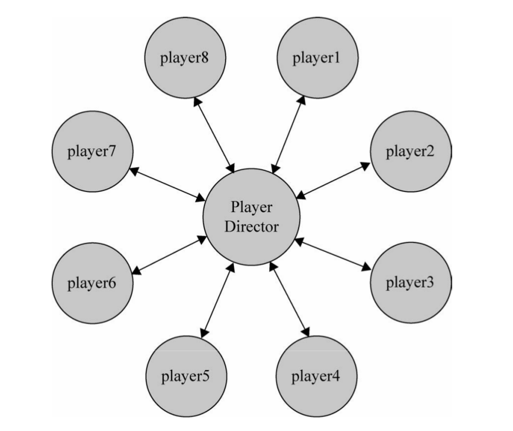

## 第14章 中介者模式

中介者模式的作用就是解除对象与对象之间的紧耦合关系。增加一个中介者对象之后，所有的相关对象都通过中介者对象来通信，而不是互相引用，所以当一个对象发生改变时，只需要通知中介者对象即可。中介者使各对象之间耦合松散，而且可以独立地改变它们之间的交互。

中介者模式最大的缺点就是系统中会新增一个中介者对象，对象间的复杂性，转移成了中介者对象的复杂性，使得中介者对象经常是巨大的。中介者对象往往就是一个难以维护的对象。

中介者模式可以非常方便地对模块或者对象进行解耦，但对象之间并非一定需要解耦。一般来说，如果对象之间的复杂耦合确实导致调用和维护出现了困难，而且这些耦合度随项目的变化呈现指数增长曲线，那我们就可以考虑用中介者模式来重构代码。也就是说，中介者模式不要轻易使用。

### 中介者模式的例子——泡泡堂

定义一个数组，用来保存所有玩家：

```js
var players = [];
```

玩家方法：

```js
function Player(name, teamColor) {
  this.partners = [];
  this.enemies = [];
  this.state = 'live';
  this.name = name;
  this.teamColor = teamColor;
};

Player.prototype.win = function() {
  console.log(`winner:${this.name}`);
};

Player.prototype.lose = function() {
  console.log(`loser:${this.name}`);
};

//每个玩家死亡的时候，都遍历其他对有的生存状况
//如果队友全部死亡，则这局游戏失败
//同时敌人队伍的所有玩家都取得胜利
Player.prototype.die = function() {
  var all_dead = true;
  this.state = 'dead';

  for (var i = 0, partner; partner = this.partners[i++]; ) {
    if (parter.state !== 'dead') {
      all_dead = false;
      break;
    }
  }

  if (all_dead === true) {//书中的代码在比较的时候全部使用显式比较，自己以后写代码也要注意这么做
    this.lose();
    for (var i = 0, partner; partner = this.partners[i++]; ) {
      parter.lose();
    }
    for (var i = 0, enemy; enemy = this.enemies[i++]; ) {
      enemy.win();
    }
  }
};
```

创建玩家的工厂方法：

```js
var playerFactory = function(name, teamColor) {
  var newPlayer = new Player(name, teamColor);

  for (var i = 0, player; player = players[i++]; ) {
    if (player.teamColor === newPlayer.teamColor) {
      player.partners.push(newPlayer);
      newPlayer.partners.push(player);
    } else {
      player.enemies.push(newPlayer);
      newPlayer.enemies.push(player);
    }
  }
  players.push(newPlayer);

  return newPlayer;
}
```

创建8个玩家，并让红队玩家全部gg：
```js
var player1 = playerFactory('皮蛋', 'red');
    player2 = playerFactory('小乖', 'red');
    player3 = playerFactory('宝宝', 'red');
    player4 = playerFactory('小强', 'red');

var player5 = playerFactory('黑妞', 'blue');
    player6 = playerFactory('葱头', 'blue');
    player7 = playerFactory('胖墩', 'blue');
    player8 = playerFactory('海盗', 'blue');

player1.die();
player2.die();
player3.die();
player4.die();
```

### 用中介者模式改造泡泡堂游戏

上面的代码使得每个玩家和其他玩家都是紧紧耦合在一起的。每个玩家都有两个属性：`this.partners`和`this.enemies`，用来保存其他玩家对象的引用。当每个对象的状态发生改变，比如角色移动、吃到道具或者死亡时，都必须 **显式地遍历通知其他对象**。



```js
function Player(name, teamColor) {
  this.name = name;
  this.teamColor = teamColor;
  this.state = 'alive';
};

Player.prototype.win = function() {
  console.log(`${this.name}won`);
};

Player.prototype.lose = function() {
  console.log(`${this.name}lost`);
};

//玩家死亡，给中介者发送消息，玩家死亡
Player.prototype.die = function() {
  this.state = `dead`;
  PlayerDirector.receiveMessage('playerDead', this);
};

//移除玩家
Player.prototype.remove = function() {
  PlayerDirector.receiveMessage('removePlayer', this);
};

// 玩家换队
Player.prototype.changeTeam = function(color) {
  playerDirector.receiveMessage('changeTeam', this, color);
};
```

工厂函数：
```js
var playerFactory = function(name, teamColor) {
  var newPlayer = new Player(name, teamColor);
  playerDirector.receiveMessage('addPlayer', newPlayer);
  return newPlayer;
};
```
首先，中介者`playerDirector`是个对象，其次，实现这个对象有以下两种方式：

1. 利用发布-订阅模式，将`playerDirector`实现为订阅者，各player作为发布者，一旦player的状态发生变化，便推送消息给playerDirector,playerDirector处理消息之后将反馈发送给其他player。

2. 在playerDirector中开放一些接收消息的接口，各player可以直接调用该接口来给playerDirector发送消息，player只需传递一个参数给playerDirector，这个参数的目的是使playerDirector可以识别发送者，同样，playerDirector接收到消息之后会将处理结果反馈给其他player。

中介者对象的代码实现如下：

```js
var playerDirector = (function() {
  var players = {},
      operations = {};//中介者可以执行的操作
  
  // 新增一个玩家
  operations.addPlayer = function(player) {
    var teamColor = player.teamColor;
    players[teamColor] = players[teamColor] || [];
    players[teamColor].push(player);
  };

  // 移除一个玩家
  operations.removePlayer = function(player) {
    var teamColor = player.teamColor,
        teamPlayers = players[teamColor] || [];

    for (var i = teamPlayers.length - 1; i >= 0; i--) {
      if (teamPlayers[i] === player) {
        teamPlayers.splice(i, 1);
      }
    }
  };

  // 玩家换队
  operations.changeTeam = function(player, newTeamColor) {
    operations.removePlayer(player);
    player.teamColor = newTeamColor;
    operations.addPlayer(player);
  };

  operations.playerDead = function(player) {
    var teamColor = player.teamPlayer,
        teamPlayers = players[teamColor];

    var all_dead = true;

    for (var i = 0, player; player = teamPlayers[i++]; ) {
      if (player.state !== 'dead') {
        all_dead = false;
        break;
      }
    }

    if (all_dead === true) {
      for (var i = 0, player; player = teamPlayers[i++]; ) {
        player.lose();
      }

      for (var color in players) {
        if (color !== teamColor) {
          var teamPlayers = players[color];
          for (var i = 0, player; player = teamPlayers[i++]; ) {
            player.win();
          }
        }
      }
    }
  };

  var receiveMessage = function() {
    var message = Array.prototype.shift.call(arguments);
    operations[message].apply(this, arguments);
  };

  return {
    receiveMessage: receiveMessage
  };
})();
```
在上面的代码里，除了中介者本身，没有一个玩家知道其他任何玩家的存在，玩家与玩家之间的耦合关系已经完全解除，某个玩家的任何操作都不需要通知其他玩家，只需要给中介者发送一个消息，中介者处理完消息之后会把处理结果反馈给其他玩家对象。

测试结果：
```js
var player1 = playerFactory('皮蛋', 'red'),
    player2 = playerFactory('小乖', 'red'),
    player3 = playerFactory('宝宝', 'red'),
    player4 = playerFactory('小强', 'red');

var player5 = playerFactory('黑妞', 'blue'),
    player6 = playerFactory('葱头', 'blue'),
    player7 = playerFactory('胖墩', 'blue'),
    player8 = playerFactory('海盗', 'blue');

player1.die();
player2.die();
player3.die();
player4.die();
```

### 中介者模式的例子——购买商品

未引入中介者的代码见`test_directorMode_buy_goods.html`

引入中介者：

```js
var mediator = (function() {
  var colorSelect = document.getElementById('colorSelect'),
      memorySelect = document.getElementById('memorySelect'),
      numberInput = document.getElementById('numberInput'),
      colorInfo = document.getElementById('colorInfo'),
      memoryInfo = document.getElementById('memoryInfo'),
      numberInfo = document.getElementById('numberInfo'),
      nextBtn = document.getElementById('nextBtn');

  return {
    changed: function(obj) {
      var color = colorSelect.value,
          memory = memorySelect.value,
          number = numberInput.value,
          goods[`${color}|${memory}`];
      
      if (obj === colorSelct) {
        colorInfo.innerHTML = color;
      } else if (obj === memorySelect) {
        memoryInfo.innerHTML = memory;
      } else if (obj === numberInput) {
        numberInfo.innerHTMl = number;
      }

      if (!color) {
        nextBtn.disabled = true;
        nextBtn.innerHTML = '请选择手机颜色';
        return;
      }
      if (!number) {
        nextBtn.disabled = true;
        nextBtn.innerHTML = '请输入购买数量';
        return;
      }
      if (!memory) {
        nextBtn.disabled = true;
        nextBtn.innerHTML = '请选择内存大小';
        return;
      }
      if ( ( ( number - 0 ) | 0 ) !== number - 0 ){
        // 输入购买数量是否为正整数
        nextBtn.disabled = true;
        nextBtn.innerHTML = '请输入正确的购买数量';
        return;
      }
      if ( number > stock ){
        // 当前选择数量没有超过库存量
        nextBtn.disabled = true;
        nextBtn.innerHTML = '库存不足';
        return ;
      }
      nextBtn.disabled = false;
      nextBtn.innerHTML = '放入购物车';
  };
})();

//事件函数：
colorSelect.onchange = function() {
  mediator.changed(this);
};

memorySelect.onchange = function() {
  mediator.changed(this);
};

numberInput.onchange = function() {
  mediator.changed(this);
};
```

### 第15章 装饰者模式

装饰者模式可以动态（程序运行期间）地给某个对象添加一些额外的职责，而不会影响从这个类中派生的其他对象。

### 模拟传统面向对象语言的装饰者模式

背景：飞机大战的游戏，随着经验值的增加，操作的飞机对象可以升级成更厉害的飞机，一开始这些飞机只能发射普通的子弹，升到第二级时可以发射导弹，升级到第三级时可以发射原子弹。

```js
var Plane = function(){};

Plane.prototype.fire = function() {
  console.log('发射普通子弹');
};

//增加两个装饰类，分别是导弹和原子弹

var MissileDecorator = function(plane) {
  this.plane = plane;
};

MissileDecorator.prototype.fire = function() {
  this.plane.fire();
  console.log('发射导弹');
};

var AtomDecorator = function(plane) {
  this.plane = plane;
};

AtomDecorator.prototype.fire = function() {
  this.plane.fire();
  console.log('发射原子弹');
};
```

装饰者模式将一个对象嵌入另一个对象之中，实际上相当与这个对象被另一个对象包装起来，形成一条包装链。请求随着这条链依次传递到所有的对象，每个对象都有处理这条请求的机会。

### javascript的装饰者写法

```js
var plane = {
  fire: function() {
    console.log('发射普通子弹');
  }
};

var missileDecorator = function() {
  console.log('发射导弹');
};

var atomDecorator = function() {
  console.log('发射原子弹');
};

var fire1 = plane.fire;
plane.fire = function() {
  fire1();
  missileDecorator();
};

var fire2 = plane.fire;
plane.fire = function() {
  fire2();
  atomDecorator();
};

plane.fire();
```

### 装饰函数

不想改变函数源代码的情况下，给函数增加功能，一种方法如下：

```js
var a = function() {
  alert(1);
};

var _a = a;

a = function() {
  _a();
  alert(2);
};

a();
```

或者

```js
window.onload = function() {
  alert(1);
};

var _onload = window.onload || function() {};

window.onload = function() {
  _onload();
  alert(2);
};
```

这种写法会遇到两个问题：

1. 必须维护_onload这个中间变量，如果函数的装饰链较长，或者需要装饰的函数较多，这些中间变量的数量也就会越来越多。

2. 还会遇到`this`被劫持的问题。发生在给中间变量赋值的时候`var _onload = window.onload || function() {};`。再比如`var _getElementById = document.getElementById;`会报错，因为`document.getElementById`内部的`this`要求指向`document`，这个在前面的章节有说过，但是通过这个赋值的过程，内部的`this`即被劫持指向`window`。

所以这种方式并不保险。

### 用AOP装饰函数

当函数通过`Function.prototype.before`或者`Function.prototype.after`被装饰后，返回的实际上是一个新的函数，如果在原函数上保存了一些属性，那么这些属性会丢失。

另外，这种装饰方式也会叠加函数的作用域，如果装饰的链条过长，性能上也会受到一些影响。

`Function.prototype.before`方法和`Function.prototype.after`方法：

```js
Function.prototype.before = function(beforefn) {
  var _self = this;
  return function() {
    beforefn.apply(this, arguments);//书里说这里保证了this不被劫持，不知道怎么保证诶
    return _self.apply(this, arguments);//书里还说这里也保证了this不被劫持，这又是怎么保证的...
  };
};

Function.prototype.after = function(afterfn) {
  var _self = this;
  return function() {
    var ret = _self.apply(this.arguments);
    afterfn.apply(this, arguments);
    return ret;
  };
};
```

**通过 Function.prototype.apply 来动态传入正确的 this ,保证了函数在被装饰
之后, this 不会被劫持。**通过下面的例子更好理解一些：

```js
document.getElementById = document.getElementById.before(function() {
  alert(1);
});
```
通过这种方式，保证了`Function.prototype.before`返回的函数中的`this`指向`document`，真是喵喵喵!

**下面是不污染原型的方法**,将原函数和新函数都作为参数传入`before`或者`after`方法中：

```js
var before = function(fn, beforefn) {
  return function() {
    beforefn.apply(this, arguments);
    return fn.apply(this, arguments);
  };
};
```

### AOP的应用实例——数据统计上报

分离业务代码和数据统计代码，是AOP的经典应用之一。

比如页面中有一个登录button，点击这个button会弹出登录浮层，于此同时要进行数据上报，来统计有多少用户点击了这个登录button。

没有使用aop的代码,在showLogin函数里，既要负责打开登录浮层，又要负责数据上报，这是两个层面的功能，却被耦合在一个函数里：

```js
var showLogin = function() {
  console.log('打开登录浮层');
  log(this.getAttribute('tag'));
};

var log = function(tag) {
  console.log(`上报标签为：${tag}`);
};

document.getElementById('button').onclick = showLogin;
```

使用aop进行分离的代码见：`test_decorator_aop1.html`

### AOP的应用实例——用AOP动态改变函数的参数

`Function.prototype.before`方法的代码如下：

```js
Function.prototype.before = function(beforefn) {
  var _self = this;
  return function() {
    before.apply(this, arguments); //.......................(1)
    return _self.apply(this, arguments);//..................(2)
  };
};
```

从(1)和(2)处可以看到，beforefn和原函数_self共用一组参数列表arguments，当我们在beforefn的函数体内改变arguments的时候，原函数_self接收的参数列表自然也会变化。

下面的代码战士了如何通过`Function.prototype.before`方法给函数`func`的参数`param`动态地添加属性b：
```js
var func = function(param) {
  console.log(param);
};

func = func.before(function(param) {
  param.b = 'b';
});
func({a: 'a'});
```

另一个示例：

```js
var ajax = function(type, url, param) {
  console.log(param);
};

var getToken = function() {
  return 'Token';
};

ajax = ajax.before(function(type, url, parm) {
  param.Token = getToken();
});

ajax('get', 'http://xxx.com/userinfo', {name: 'sven'});// {name:'sven', Token: 'Token'}
```

### AOP的应用实例——插件式的表单验证

未使用AOP分离的代码：

```html
<!DOCTYPE html>
<html lang="en">
<head>
  <meta charset="UTF-8">
  <meta name="viewport" content="width=device-width, initial-scale=1.0">
  <meta http-equiv="X-UA-Compatible" content="ie=edge">
  <title>AOP应用——插件式表单验证</title>
</head>
<body>
  用户名： <input type="text" id="username" />
  密码：  <input type="password" id="password" />
  <input id="submitBtn" type="button" value="提交" />
</body>
<script>
  var username = document.getElementById('username'),
      password = document.getElementById('password'),
      submitBtn = document.getElementById('submitBtn');

  var ajax = function(param) {
    console.log(param);
  };

  var formSubmit = function() {
    if (username.value === '') {
      return console.log('用户名不能为空');
    }
    if (password.value === '') {
      return console.log('密码不能为空');
    }
    var param = {
      username: username.value,
      password: password.value
    };

    ajax(param);
  };

  submitBtn.onclick = function() {
    formSubmit();
  };
</script>
</html>
```

使用AOP分离`validate`和`formSubmit`：
```js
Function.prototype.before = function(beforefn) {
  var _self = this;
  return function() {
    if (beforefn.apply(this, arguments) === false) {
      return;
    }
    return _self.apply(this, arguments);
  }
};

var validate = function() {
  if (username.value === '') {
    console.log('用户名不能为空');
    return false;
  }
  if (password.value === '') {
    console.log('密码不能为空');
    return false;
  }
};

var ajax = function(param) {
  console.log(param);
};

var formSubmit = function() {
  if (validata() === false) {
    return;
  }
  var param = {
    username: username.value,
    password: password.value
  };

  ajax(param);
};

formSubmit = formSubmit.before(validate);
```

上面这段代码中，校验输入和提交表单的代码完全分离开来，它们不再有任何耦合关系，上面最后一行代码如同把校验规则动态接在`formSubmit`函数之前，`validate`成为了一个即插即用的函数，它甚至可以被写成配置文件的形式，这有利于分开维护这两个函数。再利用策略模式稍加改造，就可以把这些校验规则都写成插件的形式，用在不同的项目中。

### 装饰者模式和代理模式的比较

代理模式和装饰者模式最重要的区别在于它们的意图和设计目的。

代理模式的目的是，当直接访问本体不方便或者不符合需要的时候，为这个本体提供一个替代者。本体定义了关键功能，而代理提供或拒绝对它的访问，或者在访问本体之前做一些额外的事情。

装饰者模式的作用就是为对象动态加入行为。

换句话说，代理模式强调一种关系（Proxy与它的实体之间的关系），这种关系可以静态的表达，也就是说，这种关系在一开始就可以被确定。而装饰者模式用于一开始不能确定对象的全部功能时。

代理模式通常只有一层代理-本体的引用，而装饰者模式经常会形成一条长长的装饰链。


### 装饰者模式的小结

小结里说到使用装饰者模式可以避免为了让框架拥有更多的功能，而去使用一些if，else语句预测用户的实际需要。是不是可以这样理解：感觉使用条件语句就会将一些东西耦合在一起，而好多中设计模式的结果都是可以不再使用条件语句（比如职责链，代理模式，装饰者模式）。