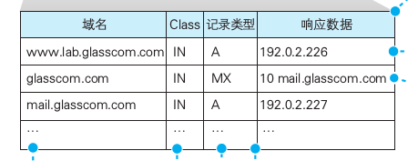

### 第一章

#### 学完这章要知道

1. 浏览器如何解析网址
2. 请求消息的格式
3. 浏览器如何向DNS服务器查询域名对应的IP地址
4. DNS服务器是如何相互接力完成IP地址查询的
5. 查询到IP地址之后，浏览器是如何将消息委托给操作系统发欧式那个给web服务器的


#### 浏览器解析网址

1. URL开头的文字，比如`http:`、`ftp:`、`file:`、`mailto`这部分文字表示浏览器应当使用的访问方法。

2. 浏览器解析URL的过程

http协议可以拆成：`协议名`、`//`、`web服务器名`、`表示数据源的路径名`四部分，解析的过程就是捋清一个URL的这四部分。

3. 文件名和目录的省略

`/`表示顶级的根目录，`dir/`表示dir目录

理论上的省略规则：
  
  1. 目录末尾的`/`不应省略

  2. 如果省略一般表示文件名字

4. 解析的目的是要知道访问的目标在哪里，就是知道`web服务器`和`文件名`。

5. 请求消息：方法 + URI（文件路径、程序路径、http开头的URL）+ http版本号

6. HTTP使用的方法

  |方法|含义|
  |---|----|
  |GET|获取URI指定的信息。若URI指定的是文件，则返回文件内容；若指定的是CGI程序，则返回改程序的输出数据|
  |POST|从客户端向服务器发送数据。一般用于发送表单中填写的数据等情况|
  |HEAD|和GET基本相同。不过它只返回HTTP的消息头，并不返回数据的内容，用于获取文件最后更新时间等属性信息|
  |OPTIONS|用于通知或查询通信选项|
  |PUT|替换URI指定的服务器上的文件。如果URI指定的文件不存在，则创建该文件|
  |DELETE|删除URI指定的服务器上的文件|
  |TRACE|将服务器收到的请求行和头部直接返回给客户端。用于在使用代理的环境中检查改写请求的情况|
  |CONNECT|使用代理传输加密消息时使用的方法|
  |||

  - 使用POST方法时，URI会指向web服务器中运行的一个应用程序的文件名（如果用node写的，这个文件名会是xxxxx.js?）

  - 使用GET方法时，当web服务器收到消息后，会打开比如/dir/file.html文件，并读取出里面的数据，然后 **将读出的数据存放到响应消息中**，并返回给客户端。


### http请求消息

请求消息的 **第一行称为请求行**，格式：请求方法[空格]URI[空格]HTTP版本号（最常用的是1.1）。

请求方法是根据浏览器的工作状态确定的。在浏览器地址栏输入网址（使用GET）或是点击网页中的超链接（使用GET）或是点击提交按钮（可能使用GET也可能使用POST），这些都会触发浏览器工作状态的改变。

**第二行开始为消息头**，消息头以一个空行结束。

当网页中包含图片时。会在网页中的相应位置嵌入表示图片文件的标签的控制信息。浏览器会显示文字时搜索相应的标签，当遇到图片相关的标签时，会在屏幕上留出用来显示图片的空间，然后再次访问web服务器，按照标签中指定的文件名向web服务器请求获取相应的图片并显示在预留空间中。

由于每条请求消息中只能写1个URI，所以每次只能获取1个文件，如果需要获取多个文件，必须对每个文件单独发送1条请求。比如1个网页中包含3张图片，那么获取网页加上获取图片，一共需要向web服务器发送4条请求。

### 向DNS服务器查询Web服务器的IP地址

生成HTTP消息之后，下一步就是根据域名查询IP地址。

数据是以包的形式传送的。

1. IP地址分为`网络号`和`主机号`。

IP地址是一串32比特的数字，按照8比特（1字节）为一组分成4组，分别用十进制表示，然后再用圆点隔开。网络号和主机号连起来总共是32比特，但这两部分的具体结构是不固定的。

子网掩码：用来帮助区分ip地址网络号和主机号。其中，子网掩码为1的部分表示网络号，子网掩码为0的部分表示主机号。边界可以划分在句点上，也可以划分在字节上。

比如：

```
10.11.12.13/255.255.255.0

10.11.12.13/24
```

主机号部分的比特全部为零，代表整个子网；主机号部分全部为1代表向子网上所有设备发送包，即广播。

```
10.11.12.0/24  -------------- 表示整个子网

10.11.12.255/24 --------------表示向子网上的所有设备发送包
```

2. **DNS**：Domain Name System。对于DNS服务器，我们的计算机上一定有相应的DNS客户端，相当于DNS客户端的部分称为DNS解析器，或者简称解析器。通过DNS查询IP地址的操作称为域名解析，因此负责执行解析这一操作的就叫解析器了。

解析器是一段程序，包含在操作系统的Socket库中（*Socket库是用于调用网络功能的程序组件集合*）。

当控制流转移到解析器后，解析器会生成要发送给DNS服务器的查询消息。这个过程与浏览器生成要发送给Web服务器的HTTP请求消息的过程类似，但HTTP消息是用文本编写的，DNS消息是用二进制数据编写的。发送消息这个操作并不是由解析器自身来执行，而是要委托给操作系统内部的协议栈来执行。

向DNS服务器发送消息时，我们当然也需要知道DNS服务器的IP地址。只不过这个IP地址是作为TCP/IP的一个设置项目事先设置好的，不需要再去查询了。

3. DNS服务器

  - 来自客户端的查询消息

      1. 域名：服务器、邮件服务器（邮件地址中@后面的部分）的名称
      2. Class：该值永远都是代表互联网的IN
      3. 记录类型：表示域名对应何种类型的记录。当类型为`A（Address）`时，表示域名对应的是IP地址;当类型为`MX(Mail eXchange)`时，表示域名对应的是邮件服务器;`PTR`类型表示根据IP地址反查域名;`CNAME`类型表示查询域名的相关别名;`NS`类型表示查询DNS服务器的IP地址;`SOA`表示查询域名属性信息。

      查询邮件服务器信息举例（见下图）：

      查询消息：

      - 域名 = glasscom.com
      - Class = IN
      - 记录类型 = MX

      查询过程：

      DNS服务器会返回`10`和`mail.glasscom.com`这两条信息。当记录类型为MX时，DNS服务器会在记录中保存两种信息，分别是邮件服务器的域名和优先级（当一个邮件地址对应多个邮件服务器时，需要根据优先级来判断哪个邮件服务器是优先的。优先级数值越小，邮件服务器代表更优先）。此外，MX记录的返回消息还包含邮件服务器`mail.glasscom.com`的IP地址。表中的第三行就是`mail.glasscom.com`的IP地址。

      

  - 域名层级

    DNS中的域名都是用句点来分隔的，比如“

    ```
    www.lab.glasscom.com
    ```
    在域名中，越靠右的位置表示其层级越高。其中，相当于与个层级的部分称为域。因此，`com`域的下一层是`glasscom`域，再下一层是`lab`域，再下面才是`www`这个名字。

    **每个域都是作为一个整体来处理的。一个域的信息是作为一个整体存放在DNS服务器中的，不能将一个域拆开来存放在多台DNS服务器中。**

    顶级域（比如com,jp）的上面还有一级域，成为根域。根域不像`com, jp`那样有自己的名字，因此在一般书写域名时经常被省略，如果要明确表示根域，应该像`www.lab.glasscom.com.`这样在域名的最后再加上一个句点，最后的这个句点就表示根域。分配给根域DNS服务器的IP地址全世界仅有13个，而且这些地址几乎不会发生变化。根域DNS服务器的相关信息已经包含在DNS服务器程序的配置文件中了，因此只要安装了DNS服务器程序，这些信息也就被自动配置好了。

  - 寻找DNS服务器

    首先，将负责管理下级域的DNS服务器的IP地址注册到她们上级DNS服务器中，然后上级DNS服务器的IP地址再注册到更上一级的NDS服务器中，以此类推。也就是说，负责管理`lab.glasscom.com`这个域（这就是上面说的每个域都是作为一个整体来处理的？）的DNS服务器的IP地址需要注册到`glasscom.com`域的DNS服务器中，而`glasscom.com`域的DNS服务器的IP地址又需要注册到`com`域的DNS服务器中。

    客户端首先会访问最近的一台DNS服务器（也就是客户端的TCP/IP设置中填写的DNS服务器地址），假设我们要查询`www.lab.glasscom.com`这台Web服务器的相关信息。由于 **最近的DNS服务器** 中没有存放`www.lab.glasscom.com`这一域名对应的信息，所以我们需要从顶层开始向下查找。**最近的DNS服务器**中保存了根域DNS服务器的信息，因此它会将来自客户端的查询消息转发给根域DNS服务器。根域服务器中也没有`www.lab.glasscom.com`这个域名，但根据域名结构可以判断这个域名属于com域，因此根域DNS服务器会返回它所管理的com域中的DNS服务器的IP地址。接下来，**最近的DNS服务器**又会向com域的DNS服务器发送查询消息。com域中也没有`www.lab.glasscom.com`这个域的信息，和刚才一样，com域服务器会返回它下面的`glasscom.com`域的DNS服务器的IP地址，以此类推就能找到目标IP地址。


4. 委托协议栈发送消息

  首先，服务器一方先创建套接字，然后等待客户端向该套接字连接管道。当服务器进入等待状态时，客户端就可以连接管道了。具体来说，客户端也会先创建一个套接字，然后从该套接字延伸出管道，最后管道连接到服务器端的套接字上。当双方的套接字连接起来之后，通信准备就完成了。之后，只要将数据送入套接字就可以收发数据了。

  当数据全部发送完毕，连接的管道将会被u断开。管道在连接时是由客户端发起的，但在断开时可以由客户端或服务器任意一方发起。其中一方断开后，另一方也会随之断开，当管道断开后，套接字也会被删除。到此为止，通信操作就结束了。

  总结一下，分为下面四个步骤：

  - 创建套接字

    客户端创建套接字时，调用Socket库中的socket程序组件。套接字创建完成后，协议栈会返回一个描述符，**应用程序**会将收到的描述符存放在内存中。描述符使用来识别不同的套接字的。

  - 将管道连接到服务器端的套接字上

    调用Socket库中名为connect的程序组件来完成连接操作。调用这个函数需要传入三个参数：`描述符`，`IP地址`和`端口号`。

    关于端口号解释如下：连接操作的对象是某个具体的套接字，因此必须要识别到具体的套接字才行，仅凭IP地址是无法做到这一点的。当同时制定IP地址和端口号时，就可以明确识别出某台具体的计算机上的某个具体的套接字。描述符是用来在一台计算机内部识别套接字的机制，那么端口号就是用来让通信的另一方能够识别出套接字的机制。

    端口号都是事先约定好的，`Web使用80作为端口`，`电子邮件使用25作为端口`。**如果同时创建了多个连接，不可能多个连接都连80端口吧？问题是：端口号和套接字是不是一一对应的？**

  - 收发数据

    发送的数据：根据用户输入的网址生成的HTTP请求消息。

    调用write程序完成发送过程。

    接收消息的操作是通过Socket库中的read程序组件委托协议栈来完成的，调用read时，需要制定用于存放接收到的响应消息的内存地址，这一内存地址称为接收缓冲区。当服务器返回响应消息时，read就会负责将接收到的响应消息存放到接收缓冲区中。由于接收缓冲区是一块位于应用程序内部的内存空间，因此当消息被存放到接收缓冲区时，就相当于已经转交给了应用程序。

  - 断开管道并删除套接字

    这一阶段需要调用Socket库的close程序组件。最终，连接在套接字之间的管道会被断开，套接字本身也会被删除。

    **HTTP协议规定，当Web服务器发送完响应消息之后，应当主动执行断开操作**。因此Web服务器会首先调用close来断开连接。接下来，当浏览器调用read执行接收数据操作时，read会告知浏览器收发数据操作已经结束，连接已经断开。浏览器得知后，也会调用close进入断开阶段。

    `HTTP1.1`可以使用在一次连接中收发多个请求和响应的方法，在这种情况下，当所有数据都请求完成后，浏览器会主动触发断开连接的操作。

  上面的四个操作都是浏览器委托协议栈调用Socket库中的程序组件来执行的。

