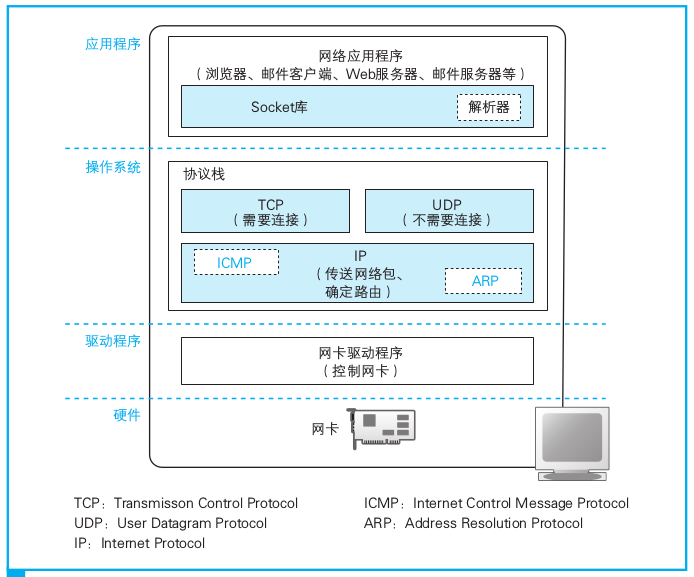
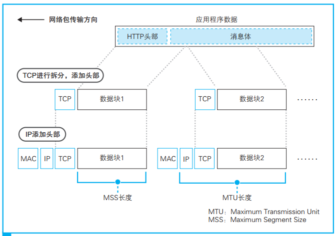
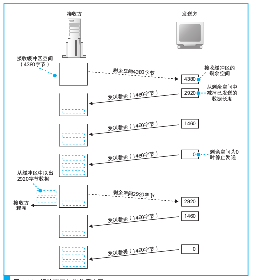

### 第二章 用电信号传输TCP/IP数据

这一章是讲协议栈（网络控制软件）和网卡（网络硬件）。

1. 协议栈内部结构



从图中可以看到，协议栈的上半部分有两块，分别是负责用TCP协议收发数据的部分和负责用UDP协议收发数据的部分，它们会接受应用程序的委托执行收发数据的操作。**像浏览器、邮件等一般的应用程序都是使用TCP收发数据的，而像DNS查询等收发较短的控制数据的时候则使用UDP。**

2. 套接字的实体就是通信控制信息

在 **协议栈内部** 有一块用于 **存放控制信息的内存空间**，这里记录了用于控制通信操作的控制信息，例如通信对象的 **IP地址**、**端口号**、**通信操作的进行状态**等。套接字只是一个概念，并不存在实体，如果一定要赋予它一个实体，我们可以说这些控制信息就是套接字的实体，或者说是存放控制信息的内存空间就是套接字的实体。

*windows*中使用`webstat`来显示套接字，ubuntu中使用`ss`显示类似的信息，更多操作指令见[此处](https://blog.csdn.net/zeweig/article/details/51760624)。

3. 创建套接字

应用程序调用`socket`申请创建套接字。

**创建套接字时，首先分配一个套接字所需的内存空间，然后向其中写入初始状态。**

在这个过程中，协议栈首先会分配用于存放一个套接字所需的内存空间。用于记录套接字控制信息的内存空间并不是一开始就存在的，因此我们逍遥开辟u出来这样一块空间，相当与为控制信息准备了一个容器。套接字刚刚创建时，数据收发操作还没有开始，因此需要在套接字的内存空间中写入表示这一初始状态的控制信息。到这里，创建套接字的操作就完成了。

套接字中记录了通信双方的信息以及通信处于怎样的状态，所以只需要通过描述符确定了相应的套接字，协议栈就能获取所有的相关信息。

4. 连接操作的含义

---
##### 插个嘴

这里插个嘴，之前的笔记里应该是有写错的地方，比如连接这里，书上的写法是：

>创建套接字之后，应用程序（浏览器）就会调用connect，协议栈会将本地的套接字与服务器的套接字进行连接

看到没，是浏览器调用了Socket库中的程序！！！
---

**连接的本质是双方交换控制信息**

套接字刚刚创建完成时，里面并没有存放任何数据，也不知道通信对象是谁。在这个状态下，即便应用程序要求发送数据，协议栈也不知道数据应该发送给谁。**浏览器**可以根据网址来查询服务器的IP地址，而且根据规则也知道该使用80端口，但只有浏览器知道这些必要的信息是不够的，因为在调用socket创建套接字的时候，这些信息并没有传递给协议栈。因此，**我们需要把服务器的IP地址和端口号等信息告知协议栈，这是连接操作的目的之一。**

服务器上也会创建套接字，和客户端不同的是，在服务器上，连应用程序也不知道通信对象是谁。 **客户端向服务器传达开始通信的请求，向服务器告知必要的信息，也是连接操作的目的之一。**

当执行数据首发操作时，我们还需要一块用来临时存放要首发的数据的内存空间，这块内存空间称为缓冲区，**它也是在连接操作的过程中分配的。**

##### 控制信息

**控制信息**:用来控制数据收发操作所需的一些信息。

第一类：是客户端和服务器相互联络时交换的控制信息。这些信息不仅连接时需要，包括数据收发和断开连接操作在内，整个通信过程中都需要。 *这些信息记录在网络包的头部。*

第二类：**保存在套接字中**，用来控制协议栈操作的信息。应用程序传递来的信息以及从通信对象接收到的信息都会保存在这里，还有收发数据操作的执行状态等信息也会保存在这里，协议栈会根据这些信息来执行每一步的操作。 *协议栈具体需要哪些信息会根据协议栈本身的实现方式不同而不同。因为协议栈中的控制信息通信对方是看不见的，只要在通信时按照规则将必要的信息写入头部，客户端和服务器之间的通信就能够得以成立。*

5. 连接操作的实际过程

连接操作从应用程序调用Socket库的connect开始：

```
connect(< 描述符 >, < 服务器 IP 地址和端口号 >, ...)
```

上面的调用提供了服务器的IP地址和端口号，这些信息会传递给协议栈中的TCP模块。然后，TCP模块会与该IP地址对应的对象，也就是与服务器的TCP模块交换控制信息，这一交互过程包括下面几个步骤。

- 首先，客户端先创建一个包含表示开始数据收发操作的控制信息的头部。
- 然后，我们将头部中的控制位的SYN比特设置为1，可以认为它表示连接；
- 当TCP头部创建好之后，接下来TCP模块会将信息传递给IP模块并委托它进行发送IP模块执行网络包发送操作之后，网络包机会通过网络到达服务器，然后服务器上的IP模块会将收到的数据传递给TCP模块，服务器的TCP模块根据TCP头部中的信息找到端口号对应的套接字。找到对应的套接字之后，套接字中会写入相应的信息，并将状态改为正在连接。
- 上述操作完成之后，服务器的TCP模块会返回响应，这个过程和客户端一样，需要在TCP头部中设置发送方和接收方端口号以及SYN比特。此外，在返回响应时，还需要将ACK控制位设为1，表示已经收到相应的网络包。（**设置ACK比特的目的就是用来在双方通信过程中互相确认网络包是否已经送达。**）
- 接下来，服务器TCP模块会将TCP头部传递给IP模块，并将IP模块向客户端返回响应。然后，网络包就会返回客户端，通过IP模块到达TCP模块，并通过TCP头部的信息确认连接服务器的操作是否成功。如果SYN为1则表示连接成功，这时会向套接字中写入服务器的IP地址、端口号等信息，同时还会将状态改为连接完毕；
- 最后，服务器返回响应时将ACK比特设置为1，相应的，客户端也需要将ACK比特设置为1并返回服务器，告诉服务器刚才的响应包已经收到。当这个服务器收到这个返回包之后，连接操作才算全部完成。

6. 收发数据

```
write()
```

数据收发操作是从应用程序调用`write`将要发送的数据交给协议栈开始的，协议栈收到数据后执行发送操作。

要点：

- 协议栈不关心应用程序传来的数据是什么内容。应用程序在调用`write`时会指定发送数据的长度，在协议栈看来，要发送的数据就是一定长度的二进制字节序列而已。
- 协议栈并不是一收到数据就马上发送出去，而是会将数据存放在 **内部的发送缓冲区** (*这个缓冲区是什么时候创建的？连接阶段？*)中，并等待应用程序的下一段数据。一次将多少数据交给协议栈是由应用程序自行决定的，协议栈并不能控制这一行为。

    发送大量的小包会导致网络效率降低。

    判断网络包的大小：

    1. 协议栈会根据一个叫作`MTU`的参数来进行判断。`MTU`表示一个网络包的最大长度，在以太网中一般是1500字节。MTU是包含头部的总长度，因此需要从`MTU`减去头部的长度，然后得到的长度就是一个网络包中所能容纳的最大数据长度，这一长度叫作`MSS`。当从应用程序收到的数据长度超过或者接近MSS时再发送出去，就可以避免发送大量小包的问题了。
    2. 另一个判断要素是时间。当应用程序发送数据的频率不高的时候，如果每次都等到长度接近MSS时再发送，可能会因为等待时间太长而造成发送延迟，这种情况下，即便缓冲区中的数据长度没有达到MSS，也应该发送出去。为此，协议栈的内部有一个计时器，当经过一定时间之后，就会把网络包发送出去。

    上面两个因素是互斥的，协议栈给应用程序保留了控制发送时机的余地。像浏览器这种会话型应用程序再向服务器发送数据时，等待填满缓冲区会导致延迟产生很大影响，因此一般会使用直接发送的选项。

    ##### 对较大数据进行拆分

    提交数据的情况，比如在博客或者论坛上发表一篇长文就属于这种情况。


    

- 使用ACK号确认网络包已收到

    TCP具备确认对方是否成功收到网络包，以及当对方没收到时进行重发的功能，因此在发送网络包之后，接下来还需要进行确认操作。

    ###### 确认原理

    - 首先，TCP模块在拆分数据时，会先计算好每一块数据相当于 **从头开始的第几个字节**，接下来在发送这一块数据时，将算好的字节数写在TCP头部中，“序号”字段就是派在这个用场上的。
    - 然后，发送数据的长度也需要告知接收方，不过这个并不是放在TCP头部里面的，因为用整个网络包的长度减去头部的长度就可以得到数据的长度。

    通过这些信息，接收方还能够检查收到的网络包有没有遗漏，如果确认没有遗漏，接收方会将到目前为止接受到的数据长度加起来，计算出一共已经收到了多少个字节，然后将这个数值写入TCP头部的ACK号中发送给发送方。这个返回ACK号的操作被称为确认响应，通过这样的方式，发送方就能够确认对方到底收到了多少数据。

    在实际的通信中，序号并不是从1开始的，而是需要用随机数计算出一个初始值，这时因为如果需要都从1开始，通信过程就会非常容易预测，有人会利用这一点来发动攻击。**在连接过程中，有一个将SYN控制位设为1并发送给服务器的操作，就是在这一步将序号的初始值告知对方的。实际上，在将SYN设为1的同时，还需要同时设置序号字段的值，而这里的值就代表序号的初始值。**

    - 双向通信的过程原理：首先客户端先计算出一个序号，然后将序号和数据一起发送给服务器，服务器收到之后会计算ACK号并返回给客户端；相反地，服务器也需要先计算出另一个序号，然后将序号和数据一起发送给客户端，客户端收到之后计算ACK号并返回给服务器。此外，客户端和服务器双方都需要各自计算序号，因此双方需要在连接过程中互相告知自己计算的序号初始值。

    TCP采用这样的方式确认对方是否收到了数据，在得到对方确认之前，发送过的包都会保存的发送缓冲区中。如果对方没有返回某些包对应的ACK号，那么就重新发送这些包。

    **ACK号目测是唯一的保证机制，网卡、集线器、路由器都没有补偿机制。如果发生网络中断、服务器宕机等问题，那么无论TCP怎样重传都不管用。这种情况下，无论如何尝试都是徒劳。因此TCP会在尝试几次重传无效之后强制结束通信，并向应用程序报错。**

    - 根据网络包平均往返事件调整ACK号等待时间

        - 返回ACK号的等待时间（超时时间）

        TCP采用了动态调整等待时间的方法，这个等待事件是根据ACK号返回所需的时间来判断的。具体来说，TCP会在发送数据的过程中持续测量ACK号的返回时间，如果ACK号返回变慢，则相应延长等待时间；相对地，如果ACK号马上就能返回，则相应缩短等待时间。

    - 滑动窗口方式发送数据包

        滑动窗口：就是在发送一个包之后，不等待ACK号返回，而是直接发送后续的一系列包。这样一来，等待ACK号的这段事件就被有效利用起来了。
        
        窗口大小：能够接收的最大数据量。

        接收方会通过TCP头部中的窗口字段将自己能接收的数据量告知发送方。这样一来，发送方就不会发送过多的数据，导致超出接收方的处理能力了。

        

    - ACK与窗口的合并

        - 更新窗口大小的时机应该是接收方从缓冲区中取出数据传递给应用程序的时候
        - 返回ACK号的时机因该是当接收方收到数据，确认内容没有问题的时候

        最佳的操作是，接收方在发送ACK号和窗口更新时，并不会马上把包发送出去，而是会等待一段时间，这样就可以把两种通知合并在一个包里面发送了。当需要连续发送多个ACK号时，可以只发送最后一个ACK号，中间的可以全部省略。同样的，当需要连续发送多个窗口更新时，可以省略中间过程，只发送最终的结果就可以了。上面的操作都可以减少包的发送数量。


7. 接收HTTP响应消息
   
   首先浏览器在委托协议栈发送请求消息之后，会调用`read`程序来`获取`响应消息。然后，控制流程会通过read转移到协议栈，之后，协议栈会执行接下来的操作。和发送数据一样，接收数据也需要将数据暂存到接收缓冲区中。如果响应消息没有返回，接收缓冲区中并没有数据，那么接收数据的操作也就无法继续。这时，协议栈会将应用程序的委托，也就是从接收缓冲区中取出数据并传递给应用程序的工作暂时挂起，等服务器返回的响应消息到达之后再继续执行接收操作。

   协议栈会检查接收道德数据块和TCP头部的内容，判断是否有数据丢失，如果没有问题则返回ACK号。然后，协议栈将数据块暂存到接收缓冲区中，并将数据块按顺序连接起来还原出原始的数据，将数据复制到应用程序执行的内存地址中，然后将控制流程交回应用程序。将数据交给应用程序之后，协议栈还需要找到合适的时机，向发送方发送窗口更新。

8. 从服务器断开并删除套接字

    - 断开连接
      
      在HTTP1.1中，服务器返回响应消息之后，客户端还可以继续发起下一个请求消息，如果接下来没有请求要发送了，**客户端**一方会发起断开过程。

      服务器一方发起的断开过程的说明：

      首先，服务器一方的应用程序会调用Socket库的close程序。然后，服务器的协议栈会生成包含断开信息的TCP头部，具体来说就是将控制位中的FIN比特设为1。接下来，协议栈会委托IP模块向客户端发送数据。同时，服务器的套接字中也会记录下断开操作的相关信息。

      接下来轮到客户端。当接收到服务器发来的FIN为1的TCP头部时，客户端的协议栈会将自己的套接字标记为进入断开操作的状态。然后，为了告知服务器已收到FIN为1的包，客户端会想服务器返回一个ACK号。这些操作完成之后，协议栈就可以等待应用程序来取数据了。

      过了一会儿，应用程序就会调用read来读取数据。这时，协议栈不会向应用程序传递数据，而是会告诉应用程序（浏览器）来自服务器的数据已经全部收到了。客户端应用程序会调用close来结束数据收发操作，这时客户端的协议栈也会服务器一样，生成一个FIN比特为1的TCP包，然后委托IP模块发送给服务器。一段时间之后，服务器就会返回ACK号。到这里，客户端和服务器的通信就全部结束了。