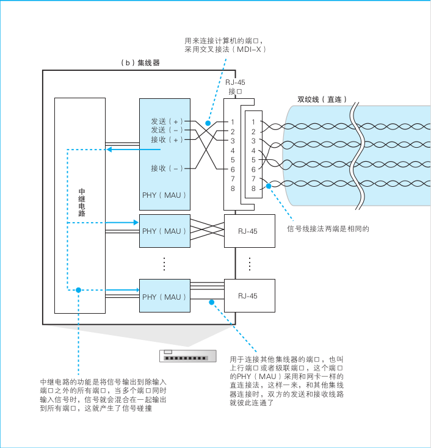

### 第三章 集线器、交换机和路由器

#### 重点

1. 信号在网线和集线器中传输的方式以及抑制信号失真

2. 交换机的包转发

3. 路由器的包转发

4. 路由器的其他功能

#### 知识点

1. 包是独立传输的

HTTP请求的方法，TCP的确认响应和序号，客户端和服务器之间的关系，这一切都与包的传输无关。因此，所有的包在传输到目的地的过程中都是独立的，相互之间没有任何关联。

2. 信号失真产生通信错误的原因

以太网中的信号波形是方形的，但损失能量会让信号的拐角变圆，这是因为电信好的频率越高，能量的损失率越大。信号的拐角意味着电压发生剧烈的变化，而剧烈的变化意味着这个部分的信号频率很高。高频信号更容易损失能量，因此本来剧烈变化的部分就会变成缓慢的变化，拐角也就变圆了。

再加上噪声的影响，失真就更厉害了，就会出现对0和1的误判，这就是产生通信错误的原因。

3. 双绞线抑制噪声

噪声的种类：

  1. 外源性噪声
  2. 内源性噪声（串绕）

抑制噪声的原理：

  1. 抑制外源性：外来电磁波在两根信号线中产生的噪声电流方向相反，使得噪声电流互相抵消，噪声就得到了抑制

  2. 抑制内源性：每一对信号线的间距都有一定的差异，这使得在某些地方正信号线距离近，另一些地方则是负信号线距离近。正负信号线产生的噪声影响是相反的，二者就会相互抵消。从网线整体来看，正负的分布保持平衡，自然就会削弱噪声的影响。

4. 集线器的功能
以太网的基本架构就是将包发到所有的设备，然后由设备根据接受方MAC地址来判断应该接收哪些包。**当信号到达集线器后，会被广播到整个网络中。**

中继电路的基本功能就是将输入的信号广播到集线器的所有端口上。

信号从所有接口流出，到达连接在集线器上的所有设备。然后，这些设备在收到信号之后会通过MAC头部中的接收方MAC地址判断是不是发给自己的，如果是发给自己的就接受，否则就忽略。

这样，网络包就能够到达指定MAC地址的接收方了。

由于集线器只是原封不动地将信号广播出去，所以即便信号受到噪声的干扰发生了失真，也会原样发送到目的地。这是，接收信号的设备，也就是交换机、路由器、服务器等，会在将信号转换成数字信息之后通过FCS校验（帧校验序列）发现错误，并将出错的包丢弃。协议栈的TCP模块会检测到丢包并对该包进行重传。

5. 交换机的包转发

**交换机的设计是将网络包原样转发到目的地。**

交换机根据MAC地址表查找MAC地址，然后将信号发送到相应的端口。

###### MAC地址表的维护

交换机在转发包的过程中，还需要对MAC地址表的内容进行维护，维护分为两种：

  - 第一种：收到包时，将发送方MAC地址以及其输入端口的号码写入MAC地址表中

  - 第二种：删除地址表中某条记录。删除的时间一般为几分钟

  交换机会自行更新或删除地址表中的记录，不需要手动维护。

###### 特殊操作

  - 当交换机发现一个包要发回原端口时，就会直接丢弃这个包

  - 当地址表中找不到指定的MAC地址时，交换机无法判断应该把这个包转发到哪个端口，只能将包转发到除了源端口之外的所有端口上，无论该设备连接在哪个端口上都能收到这个包。

  - 如果接受方MAC地址是一个广播地址，那么交换机会将包发送到除源端口之外的所有端口。

###### 全双工模式

全双工模式是交换机特有的工作模式，它可以同时进行发送和接收操作，集线器不具备这样的特性。

只要不使用集线器，就不会发生碰撞。

交换机的全双工模式可以同时发送和接收信号。

