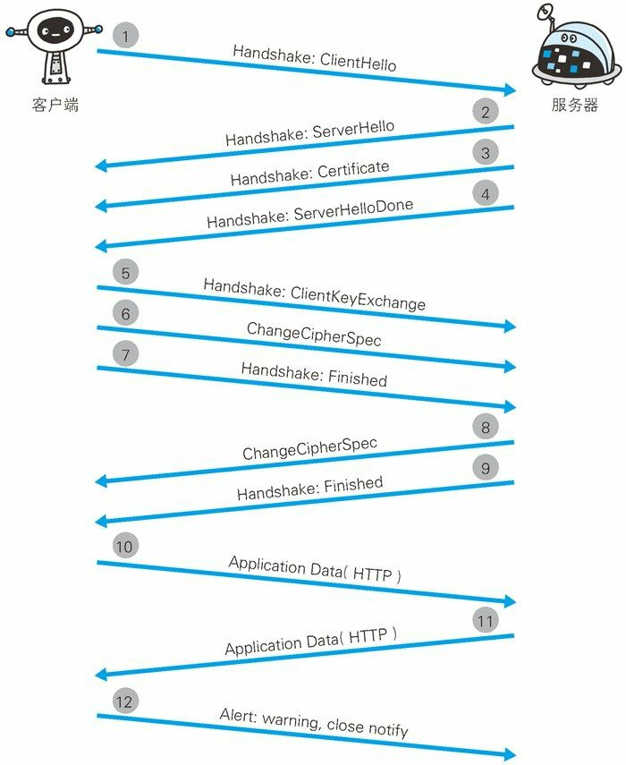
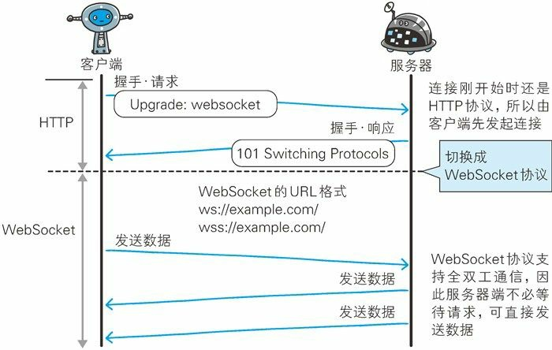

看了一周多,总算看完了.感觉有点枯燥...想起去年鞠大神和我说的如果可以看下《http权威指南》,但说这书很厚而且看起来有些枯燥,不会是讲http的书都这样吧...

感觉能直接用到的就是状态码和报文首部,这些可以在开发过程中慢慢熟悉,一下全看了真的好烦,特别是各种首部字段...

感觉这本书看起来更像看科普.

说说收获吧:
1. 了解了网络通信的结构
2. 了解报文的构成
3. 了解了常用的状态码,共分5类:
  - 1xx: 正在处理
  - 2xx: 成功
  - 3xx: 重定向
  - 4xx: 客户端错误
  - 5xx: 后端错误
4. 了解了代理,网关,隧道
5. 了解了http的局限性
6. 了解了https, 知道了平日浏览器里说的证书是神马东西
7. 对于Ajax的理解有了那么一点顿悟的感觉,2333
8. 了解了webSocket
9. 其他一些比如静态,动态内容,CGI,攻击啥的

### 第一章 了解web及网络基础

- TIC/IP协议族
  想这样把与互联网相关连的协议集合起来总称为TCP/IP.TCP/IP协议族按层次分别分为以下4层:应用层,传输层,网络层,数据链路层.

  - 应用层
    TIC/IP协议族内预存了各类通用的应用服务.比如FTP,DNS,HTTP

  - 传输层
    传输层对上层应用层,提供处于网络连接中的两台计算机之间的数据传输.在传输层中有两个性质不同的协议:TCP(传输控制协议)和UDP(用户数据报协议)

  - 网络层
    网络层用来处理网络上流动的数据包.数据包是网络传输的最小数据单位.该曾规定了通过怎样的路径(所谓的传输路线)到达对方计算机,并把数据包传送给对方.  
    与对方计算机之间通过多台计算机或网络设备进行传输时,网络层所起的作用就是在众多的选项内选择一条传输路线.

  - 链路层
    用来处理连接网络的硬件部分,包括控制系统,硬件的设备驱动,网卡,光纤等物理可见部分.硬件上的范畴均在链路层的作用范围内.

**一次web页面发送http请求的过程**  
    1. 作为发送端的客户端在应用层发出一个想看某个web页面的http请求.
    2. 为了传输方便,在传输层(TCP协议)把从应用层处收到的数据(http请求报文)进行分割,并在各个报文上打上标记序号及端口号后转发给网络层
    3. 在网络层(IP协议)增加作为通信目的地的MAC地之后转发给链路层.**至此,发往网络的通信请求就准备齐全**
    4. 接收端的服务器在链路层接收到数据,按序往上层发送,一直到应用层,当传输到应用层,才能算真正接收到由客户端发送过来的http请求.  

  发送端在层与层之间传输数据时,没经过一层时必定会被打上一个该层所属的首部信息.反之,接收端在层与层传输数据时,每经过一层时会把对应的首部消去.

- ip, tcp, dns, http
  - ip:位于网络层.ip协议的作用是把各种数据包传送给对方.其中最终要的条件是ip地址和MAC地址.
  - tcp:位于传输层.tcp协议为了更容易传送大数据才把数据分割,而且tcp协议能够确认数据最终是否送达到对方.
    tcp协议采用三次握手策略: 发送端首先发送一个带有SYN的标志的数据包给对方.接收端收到后,回传一个带有SYN/ACK标志的数据包一试传达确认信息.最后,发送端再回传一个带有ACK标志的数据包,代表握手结束.若在握手过程中,某个阶段莫名中断,tcp协议会再次以相同的顺序发送相同的数据包.

    字节流服务是指,为了方便传输,将大块数据分割成报文段为单位的数据包进行管理.
  - dns:位于应用层.提供域名到ip地址之间的解析服务.
  - http协议: 位于应用层.
    - 发送端:生成针对目标web服务器的http请求报文
    - 接收端:对请求内容进行处理
- URI格式(p27有)

### 第二章 简单的http协议

- 请求报文的构成
  方法,uri,协议版本,请求首部字段,内容实体
- 相应报文构成
  协议版本,状态码,状态码的原因短语,相应首部字段,主体
- http协议不保存状态,所以诞生了cookie
- http/1.1中可以使用的方法
  GET:获取资源
  POST:传输实体主体
  PUT:传输文件
  HEAD:获取报文首部
  DELETE:删除文件
  OPTIONS: 询问支持的方法
  TRACE:追踪路径
  CONNECT:要求用隧道协议(SSL,TSL)连接代理
- TCP持久连接
  只要任意一端没有明确提出断开连接,则保持TCP连接状态.在http/1.1中,所有的连接默认都是持久连接.
- 管线化技术允许同时并行发送多个请求.
- cookie技术
  cookie技术通过在请求和相应报文中写入cookie信息来控制客户端的状态.
  **Cookie会根据从服务器端发送的相应报文内的一个叫做SET-Cookie的首部字段信息,通知客户端保存Cookie.当下次客户端再往该服务器发送请求时,客户端会自动在请求报文中加入Cookie值后发送出去.**
  服务器端发现客户端发送过来的Cookie后,会去检查究竟是从哪一个客户端发来的连接请求,然后对比服务器上的记录,最后得到之前的状态信息.

### 第三章 http报文内的http信息

- http报文
  用于http协议交互的信息被称为http报文.

  http报文大致可分为报文首部和报文主体两部分.两者由**空行(CR+LF)**来划分.通常,并不一定要有报文主体.

  **空行(CR+LF)**:CR(Carriage Return,回车符,16进制)和LF(Line Feed,换行符,16进制)

  **报文首部结构**:
      1. 请求行:包含用于请求的方法,请求url和http版本
      2. 状态行:包含表明相应结果的状态码,原因短语和http版本
      3. 首部字段: 包含表示请求和相应的各种条件和属性的各类首部
      一般有四种: 通用首部,请求首部,相应首部,实体首部
      4. 其他: Cookie等

- 报文vs实体
  - 报文
    是http通信中的基本单位,由8字节组成,通过http通信传输
  - 实体
    作为请求或响应的有效荷载数据被传输,其内容由实体首部和实体主体组成

  http报文的主体用于传输请求或响应的实体主体.通常,报文主体等于实体主体,只有当传输中进行编码操作时,实体主体的内容发生变化,才导致它和报文主体产生差异.

### 第四章 返回结果的http状态码
- 状态码的类别

  |      | 类别       | 原因短语          |
  | ---- | -------- | ------------- |
  | 1xx  | 信息性状态码   | 接收的请求正在处理     |
  | 2xx  | 成功状态码    | 请求正常处理完毕      |
  | 3xx  | 重定向状态码   | 需要进行附加操作以完成请求 |
  | 4xx  | 客户端错误状态码 | 服务器无法处理请求     |
  | 5xx  | 服务器错误状态码 | 服务器处理请求出错是    |

  ​
- 常用的14个状态码
  - 200 ok
    表示从客户端发来的请求在服务器端被正常处理了

  - 204 No Content
    表示服务器接收的请求已成功处理,但在返回的响应报文中不含实体的主体部分,也不允许返回任何实体的主体.返回204响应,浏览器显示的页面不发生更新.

  - 206 Partial Content
    表示客户端进行了范围请求,服务器成功执行了这部分的GET请求,响应报文中包含由Content-Range指定范围的实体内容.

  - 301 Moved Permanently
    表示请求的资源已被分配了新的url,以后应使用资源现在所指的url.

  - 302 Found
    表示请求的资源已经被分配了新的url,希望用户本次能使用新的uri访问.和301状态码相似,但302状态码代表的资源不是被永久移动,只是临时性质的.

  - 303 See Other
    表示由于请求对应的资源存在着另一个url,应使用GET方法定向获取请求的资源,**明确表示!!!**

  - 304 Not Modified
    表示客户端发送附带条件的请求时,服务器端允许请求访问资源,但未满足条件的情况.304状态码返回的时候,不包含任何响应的主体部分.304虽然被划分在3xx类别中,但是和重定向没有任何关系.

    *附带条件:指的是采用GET方法的请求报文中包含if-Match, if-Modified-Since, if-None-Match, If-Range, If-Unmodified-Since中任一首部.*
  
  - 307 Temporary Redirect
    临时重定向
  
  - 400 Bad Request
    表示请求报文中存在语法错误.当错误发生时,需修改请求的内容后再次发送请求.

  - 401 Unauthorized
    表示发送的请求需要有通过http认证的认证信息,另外,若之前已经行过1次请求,则表示用户认证失败.

  - 403 Forbidden
    表明对请求资源的访问被服务器拒绝了,服务器端没有必要给出拒绝的详细理由,但如果想作说明的话,可以在实体的主体部分对原因进行描述.

  - 404 Not Found
    表明服务器上无法找到请求的资源,除此之外,也可以在服务器端拒绝请求且不想说明理由时使用.

  - 500 Internal Server Error
    表明服务器端在执行请求时发生了错误.也有可能是web应用存在bug或某些临时的故障.

  - 503 Service Unavailable
    表明服务器暂时处于超负载或正在进行停机维护,现在无法处理请求.
  
  **what?!!!!!!!!状态吗和状况的不一致: 不少返回的状态码响应都是错误的,但是用户可能察觉不到这点.比如web应用程序内部发生错误,状态码依然返回200 ok,这种情况也经常遇到.**

  ### 第五章 与http协作的web服务器

- 用单台虚拟主机实现多个域名

  一台物理机,使用虚拟主机功能,可以看起来有多台服务器.

  **在相同的IP地址下,由于虚拟主机可以寄存多个不同主机名和域名的web网站,因此在发送http请求时,必须在Host首部内完整指定主机名或域名的uri.**

- 通信数据转发程序: 代理,网关,隧道
  - 代理: 代理是一种有转发功能的应用程序,它扮演了位于服务器和客户端之间的中间人的角色,接收由客户端发送的请求并转发给服务器,同时也接收服务器返回的响应并转发给客户端.

    - 源服务器:持有资源实体的服务器
    - 每次通过代理服务器转发请求或响应时,会追加写入Via首部信息
    - 使用代理服务器的理由:
      1. 利用缓存技术减少网络带宽的流量;
      2. 组织内部针对特定网站的访问控制,以获取访问日志为主要目的
    - 代理分类:
      1. 缓存代理: 代理转发响应时,缓存代理会预先将资源的副本缓存在代理服务器上.当代理再次接收到对相同资源的请求时,就可以不从源服务器哪里获取资源,而不是将之前缓存的资源作为响应返回.
      2. 透明代理: 转发请求或响应时,不对报文做任何加工的代理类型被称为透明代理,反之,对报文内容进行加工的代理被成为非透明代理.

  - 网关: 网关是转发其他服务器通信数据的服务器,接受从客户端发送来的请求时,它就像自己拥有资源的源服务器一样对请求进行处理.

    网关的工作机制和代理十分类似,而且网关能使通信线路上的服务器提供非http协议服务(利用网关可以由http请求转化为其他协议通信).

  - 隧道: 隧道是在相隔甚远的客户端和服务器两者之间进行中转,并保持双方通信连接的应用程序.

    隧道可以按要求建立起一条与其他服务器的通信线路,届时使用SSL等加密手段进行通信.隧道的目的是确保客户端能与服务器进行安全的通信.

- 保存资源的缓存

  - 缓存是指代理服务器或客户端本地资源盘内保存的资源副本.利用缓存可以减少对源服务器的访问,因此也就节省了通信流量和通信时间.

  - 缓存的有效期限
    即使存在缓存,也会因为客户端的要求,缓存的有效期等因素,向源服务器确认资源的有效性.若判断缓存失效,缓存服务器将会再次从源服务器上获取新资源.

### 第六章 http首部(这一部分好枯燥啊...)

- 报文首部: 在客户端和服务器处理时,起至关重要作用的信息几乎都在这里

- 报文主体: 所需要的用户和资源的信息都在这里

- http/1.1首部字段一览: p82

- 通用首部字段详细介绍: ~p85

**书里面对这两个概念的介绍好模糊啊**
- no-cache:代表不缓存过期的资源,缓存会向源服务器进行有效确认后处理资源.
- no-store:才是真正地不进行缓存.

- 请求首部字段详细介绍
  - 附带条件请求
    - 实体标记:ETag,是与特定资源关联的确定值,资源更新后ETag也会随之更新.生成ETag值时,没有统一的算法规则,仅由服务器来分配.中英文版两者的uri是相同的,所以仅凭uri指定缓存的资源是相当困难的.若在下载过程中出现连接中断,再连接的情况,都会依照ETag值来指定资源.
      - 强ETag:不论实体发生多么细微的变化都会改变其值;
      - 弱ETag:只用于提示资源是否相同.只有资源发生了根本改变,产生差异时,才会改变ETag值. 

    - 比如 If-Match: "123456",只有当If-Match的字段值和ETag值匹配一致时,服务器才会接受请求.
- 响应首部字段: ~p115
- 实体首部字段
  - Content-MD5: 
    计算过程: 对报文主体执行 MD5 算法获得的 128 位二进制数,再通过 Base64 编
            码(这是因为http首部无法记录二进制数)后将结果写入 Content-MD5 字段值。

    首部字段Content-MD5是一串由MD5算法生成的值,其目的在于检查报文主体在传输过程中是否保持完整,以及确认传输到达.

    客户端会对接收的报文主体执行相同的MD5算法,然后与首部字段Content-MD5的字段值比较.

    **这种方法无法判断内容是否中途被篡改过**

- 为Cookie服务的首部字段

调用Cookie时,由于可校验Cookie的有效期,以及发送方的域,路径,协议等信息,所以正规发布的Cookie内的数据不会因来自其他Web站点或攻击者的攻击而泄漏.

*跨过...统统跨过*

### 第七章 确保Web安全的https

- http的缺点
  1. 通信使用明文,内容可能被窃听
    解决办法:
    1. 和SSL(安全套接层)组合使用,建立安全通信线路
    2. 加密报文主体,通信过程不加密
  2. 不验证通信方的身份,因此有可能遭遇伪装
    解决办法:
    1. SSL支持证书技术,使用第三方的证书来证明通信方的身份
  3. 无法证明报文的完整性,所以有可能已遭遇篡改
    解决办法:
    1. SSL 提供的完整性保护

- HTTP+ 加密 + 认证 + 完整性保护=HTTPS

当使用SSL时,变成http先和SSL通信,再由SSL和TCP通信

  - https的混合加密机制
    在交换密钥环节使用公开密钥加密方式,之后的建立通信交换报文阶段使用共享密钥加密方式.
  - 公开密钥证书: CA.首先,服务器的运营人员向数字证书认证机构提出公开密钥的申请。数字证书认证机构在判明提出申请者的身份之后,会对已申请的公开密钥做数字签名,然后分配这个已签名的公开密钥,并将该公开密钥放入公钥证书后绑定在一起。
  - https安全通信机制(p154)
  

  这张图上哪个地方算三次握手?!**握手发生在TCP层,而SSL介于http和TCP之间,所以三次握手并没有出现在上面这张图中**

### 第八章 确认访问用户身份的认证
- 认证方式
  - BASIC认证
  - DIGEST认证
  - SSL认证
  - 基于表单认证**这个用的多**
- session管理和cookie状态管理
  1. 客户端把用户id和密码等登录信息放入报文的实体部分,通常以POST方法把请求发送给服务器.这时,会使用https通信来进行http表单画面的显示和用户输入数据的发送.
  2. 服务器会发放用以识别用户的Session ID.通过验证从客户端发送过来的登录信息进行身份认证,然后把用户的认证状态与Session ID绑定后记录在服务器端.向客户端返回响应时,会在首部字段 Set-Cookie 内写入 Session.Session ID 应使用难以推测的字符串,且服务器端也需要进行
  有效期的管理,保证其安全性。另外,为减轻跨站脚本攻击(XSS)造成的损失,建议事先在 Cookie
  内加上 httponly 属性。
  ID
  3. 客户端接收到从服务器端发来的 Session ID 后,会将其作为Cookie 保存在本地。下次向服务器发送请求时,浏览器会自动发送Cookie,所以 Session ID 也随之发送到服务器。服务器端可通过验证接收到的 Session ID 识别用户和其认证状态.

### 第九章 基于 HTTP 的功能追加协议

- http标准的瓶颈
  1. 一条连接上只可发送一个请求
  2. 请求只能从客户端开始,客户端不能接收除响应以外的指令
  3. 请求/响应首部未经压缩就发送
  4. 发送冗长的首部
  5. 可任意选择数据压缩格式
- Ajax解决方法

  和以前的同步通信相比,由于它只更新一部分页面,响应中传输的数据量会因此而减少,这一优点显而易见。

  Ajax 的核心技术是名为 XMLHttpRequest 的 API,**通过 JavaScript 脚本语言的调用就能和服务器进行 HTTP 通信**。借由这种手段,就能从已加载完毕的 Web 页面上发起请求,只更新局部页面。

  **利用Ajax实时地从服务器获取内容,有可能会导致大量请求产生.此外,Ajax仍未解决http协议本身存在的问题.**
- 使用浏览器进行全双工通信的WebSocket
  - WebSocket是通信协议
  - 一旦 Web 服务器与客户端之间建立起 WebSocket 协议的通信连接,之后所有的通信都依靠这个专用协议进行。
  - 由于是建立在 HTTP 基础上的协议,因此连接的发起方仍是客户端,而一旦确立 WebSocket 通信连接,不论服务器还是客户端,任意一方都可直接向对方发送报文。
  - webSocket通信过程
  

  ### 第十章 基于 构建 Web 内容的技术

  - 动态内容: 由程序创建的内容称为动态内容
  - 静态内容: 事先准备好的内容成为静态内容**静态页面是仅包含静态内容的页面???**
  - CGI(common gateway interface 通用网关接口)是指web服务器在接收到客户端发送过来的请求后转发给程序的一组机制
  - CGI程序:使用CGI的程序,通常用Perl,PHP,Ruby和C等语言编写而成.
