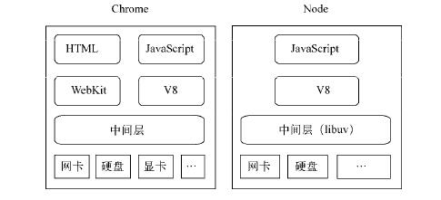
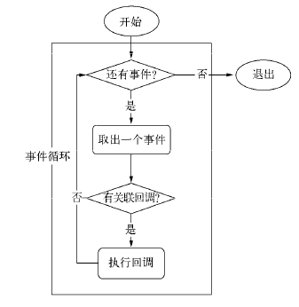
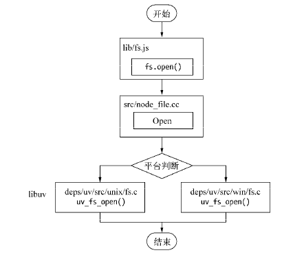

感觉这本书以目前自己的水准看，能看懂一些node的设计理念，v8的一些原理，具体到细节就不行了。

2019.1.25晚上大致翻完，感觉现在自己基本无法驾驭，我离这本书的层级差的有点多。所以，计划把书中有趣的东西整理下来，日后需要可以有据可寻，再来这里查找，感觉这应该是目前这本书的最佳学习方式了。

- 第一章 Node介绍 看的可以 :smiley:

    - chrome浏览器和Node的组件构成
    - Node的应用场景

- 第二章 模块机制 解决了一些之前的问题 可以 :smiley:

    - CommonJs规范
    - Node的模块实现

- 第三章 异步I/O 看的一般 :stuck_out_tongue_closed_eyes:

    - 异步和非阻塞的区别（感觉异步说的是应用层面，非阻塞讲的是系统内核层面）
    - Node实现异步I/O的方式：事件循环、观察者、请求对象（后两个已经不记得了...）
    - process.nextTick()和setImmediate()的区别

- 第四章 异步编程 基本没细看 :sweat_smile:

    - 异步编程的难点——感觉这部分主要是在描述当前异步写法是如何演变出来的
    - 异步编程的解决方案：订阅/发布模式、Promise模式
    - 异步并发控制：过载保护

- 第五章 内存 学到了很多 :smiley:

    - V8的垃圾回收机制和内存管理：这部分涉及很多指令操作

- 第六章 Buffer 基本没细看 :sweat_smile:

    Buffer这一部分基本不太理解，从结构部分就不太理解

    - Buffer的结构
    - Buffer的转换
    - Buffer和性能

- 第七章 网络编程 基本没细看 :sweat_smile:

    - 这一部分讲了很多原生Node的server构建和使用的方法：Tcp、UDP、http、websocket
    - 使用了命令行工具curl
    - TLS/SSL

- 第八章 构建web应用 基本没细看 :sweat_smile:

    - 后端框架的实现细节和原理：路径解析、查询字符串、cookie、session、缓存、数据上传、路由解析、RESTful、中间件、页面渲染

- 第九章 进程 基本没细看 :sweat_smile:

    - 感觉这一部分有点儿高端，暂时放下

- 第十章 测试 基本没细看 :sweat_smile:

    - 单元测试
    - 性能测试
- 第十一章 产品化 基本没细看 :sweat_smile:

---

下面是一些摘抄。

## 第一章 Node介绍

高性能web服务器的要点：事件驱动、非阻塞I/O

- Node名字的来源：Node发展为一个强制不共享任何资源的额单线程、单进程系统，包含十分事宜网络的库，为构建大型分布式应用程序提供基础设施，其目标也是成为一个构建快速、可伸缩的网络应用平台。它自身非常简单，通过通信协议来组织许多Node，非常容易通过扩展来达成构建大型网络应用的目的。每一个Node进程都构成这个网络应用中的一个节点，这个它名字所含意义的真谛。

- chrome和node的组件构成

除了HTML、webKit和显卡这些UI相关的技术没有支持外，Node的结果与Chrome十分相似，他们都是基于事件驱动的异步架构。浏览器通过事件驱动来服务界面上的交互，Node通过事件驱动来服务I/O。前后端编程环境统一，可以大大降低前后端转换所需要的上下文交换代价。

- node的特点

    1. 异步I/O
    2. 事件与回调函数
    3. 单线程
    4. 跨平台

- Node的应用场景

    1. I/O密集型——擅长
    2. CPU密集型——不擅长

        CPU密集型应用给Node带来的挑战主要是：由于Javascript单线程的原因，如果有长时间运行的的计算（比如大循环），将会导致CPU时间片不能释放，使得后续I/O无法发起。但是适当调整和分解大型运算任务为多个小任务，使得运算能够适时释放，不阻塞I/O调用的发起，这样既可以同时享受到并行I/O的好处，又能充分利用CPU。

        解决办法：

          1. Node可以通过编写c/c++扩展的方式更高效地利用CPU，将一些v8不能做到性能极致的地方通过c/c++来实现。
          2. 如果单线程的Node不能满足需求，设置用了c/c++扩展后还觉得不够，那么通过子进程的方式，将一部分Node进程当做常驻服务进程用于计算，然后利用进程时间间的消息来传递结果，将计算与I/O分离，这样还能充分利用多CPU。
          3. 作为中间层
          4. 分布式应用

## 第2章 模块机制

#### Node的模块实现

- 在Node中引入模块，需要经历如下三个步骤：

  1. 路径分析
  2. 文件定位
  3. 编译执行

- 在Node中，模块分为两类：

  1. 核心模块：Node提供的模块。这部分在Node源代码的编译过程中，编译进了二进制执行文件。在Node进程启动时，部分核心模块就被直接加载进内存中，所以这部分核心模块引入时，文件定位和编译执行这两个步骤可以省略，并且在路径分析中优先判断，所以它的加载速度是最快的。

  2. 文件模块：用户编写的模块。文件模块则是在运行动态加载，需要完整的路径分析、文件定位、编译执行过程，速度比核心模块慢。

- 优先从缓存加载

  与前端浏览器会缓存静态脚本文件以提高性能一样，Node对引入过得模块都会进行缓存，以减少二次引入时的开销。不同的是浏览器仅仅缓存文件，而Node缓存的是编译和执行后的对象。不论是核心模块还是文件模块，require方法对相同模块的二次加载都一律采用缓存优先的方式，这是第一优先级的。 **不同之处在于核心模块的缓存检查优先于文件模块的缓存检查。**

#### 从非官方源安装npm包

- 通过镜像源安装：`npm install underscore --registry=http://registry.url`
- 指定默认源：`npm config set registry http://registry.url`

## 第3章 Node的异步I/O

#### 事件循环

事件循环是Node自身的执行模型，正是它的存在，使得回调函数十分普遍。在进程启动时，Node便会创建一个类似于`While(true)`的循环，每执行一次循环体的过程我们成为`Tick`。每个Tick的过程就是查看是否有事件待处理，如果有，就取出事件及其相关的回调函数。如果存在关联的回调函数，就执行它们。然后进入下个循环，如果不再有事件处理，就退出进程。

Tick流程图：

#### 观察者

每个事件循环中都一个或者多个观察者，而判断是否有事件要处理的过程就是向这些观察者询问是否有要处理的事件。浏览器采用了类似的机制。事件可能来自用户的点击或者加载某些文件时产生，而这些产生的事件都有对应的观察者。在Node中，事件主要来源于网络请求、文件I/O等，这些事件对应的观察者有文件I/O观察者、网络I/O观察者等。

事件循环是一个典型的生产者/消费者模型。异步I/O、网络请求等则是事件的生产者，源源不断为Node提供不同类型的事件，这些事件被传递到对应的观察者哪里，事件循环则从观察者那里取出事件并处理。

#### 请求对象

对于Node中的异步I/O调用而言，回调函数不是由开发者来调用。那么从我们发出调用后，到回调函数被执行，中间发生了什么呢？

从Javascript发起调用到内核执行完I/O操作的过渡过程中，存在一种中间产物，它叫做 **请求对象**。

从Javascript调用Node的核心模块，核心模块调用c++内建模块，内建模块通过libuv进行系统调用，这是Node里经典的调用方式。

异步I/O调用示意图：

请求对象是异步I/O过程中的重要中间产物，所有的状态都保存在这个对象中，包括送入线程池等待执行以及I/O操作完毕后的回调处理。

## 第4章 异步编程

#### 异步编程解决方案

1. 事件发布/订阅模式

事件发布/订阅模式可以实现一个事件与多个回调函数的关联，这些回调函数又称为 **事件监听器**。

从另一个角度看，事件监听模式也是一种钩子机制，利用钩子导出内部数据或状态给外部的调用者。

## 第5章 内存

v8引擎

- 内存限制

32位系统0.7G左右，64位系统1.4G左右

- 垃圾清理机制

新生代使用scarvenge算法，内存分为`from`和`to`两部分，用于管理死对象多，活对象少的情况，

老生代使用mark-swip和mark-cpmpact两种算法，用于管理活对象多，死对象少的情况。前一种算法速度相对较快，但会导致内存碎片，后一种算法速度相对较慢，但内存是整块的。

v8引擎使用的是增量垃圾清理过程，优化了js的执行效率，react的fiber就是基于这个东西重构的吧。

- 及时释放内存

  1. 通过重新赋值，替换掉变量引用，释放内存。使用delete可能会干扰v8的优化，所以还是使用变量赋值
  2. 闭包的问题在于，一旦有变量引用这个中间函数，这个中间函数将不会释放，同时也会使原始的作用域不会得到释放，作用域中产生的内存占用也不会得到释放。除非不再有引用，才会逐步释放。

- 内存泄露

  1. memoize

    从前端的角度来看，这是一个很不错的缓存设计，原理是以参数作为键进行缓存，以内存空间换取CPU执行时间。这里潜藏的陷阱是每个被执行的结果都会按参数缓存，不会被清除。这在前端网页这种短时应用场景中不会存在大问题，但是执行量大和参数多样性的情况下，会造成内存占用不释放的问题。所以，在Node中，任何试图拿内存当缓存的行为都应当被限制。

    **使用redis。**

## 第6章 Buffer

看完就忘记了。。。

只记得行为类似数组，可以和字符串进行转换，可以用来解决大文件的IO。**感觉这种文件类型有点抽象。**

## 第7章 网络编程

这章也没有仔细看，构建各种协议的服务，感觉后续用到再返回头比着看效率会高一些。

## 第8章 构建web应用

其实现在跟着教程写demo写的都是这一章的内容，用的都是框架，书里讲的是一些使用node的实现方式和通用的解决办法，由于这书成书年代早，还没有现在的好多框架，所以极有可能现有的这些框架的背后思路都和这章介绍的不谋而合。

## 第9章 进程

大概瞟了一眼。

## 第10章 测试

瞟了一眼。

## 第11章 产品化

瞟了一眼，感觉很像现在公司的后端同事每天讨论的东西。